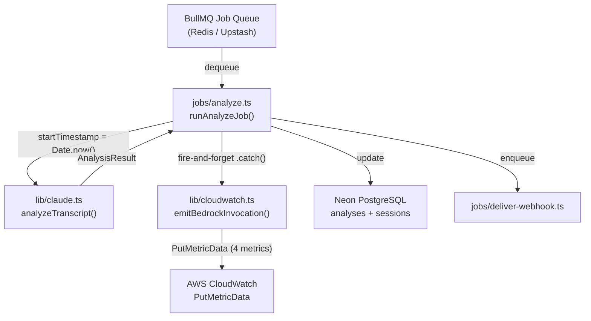

# Design Document — cloudwatch-monitoring

## Overview

This feature adds CloudWatch observability to the Hearloop API in two distinct layers:

1. **Runtime metric emission** — a new `apps/api/src/lib/cloudwatch.ts` module owns the `CloudWatchClient` singleton and a single `emitBedrockInvocation()` helper. After each successful Bedrock call in `jobs/analyze.ts`, the helper fires a single `PutMetricData` request carrying four metric data points. The call is fire-and-forget; errors are caught and logged at `warn` level so they never block session processing.

2. **Infrastructure alarms** — CPU (≥80% for 2×5 min) and memory (≥85% for 2×5 min, treat-missing-data breaching) alarms defined as AWS CLI commands stored in `infra/alarms.sh`. These are not runtime code and are never called from the API process.

The design respects three hard constraints from the project rules:
- **Single responsibility** — `cloudwatch.ts` does exactly one thing: CloudWatch client + emit helpers.
- **Free-tier protection** — emission is strictly event-driven (one `PutMetricData` per BullMQ job), no polling, no Redis interaction.
- **No new npm deps beyond `@aws-sdk/client-cloudwatch`** — already part of the AWS SDK v3 family in use.

---

## Architecture



The critical path is: `BullMQ → analyze → DB update → webhook enqueue`. CloudWatch emission is a side branch that never touches the critical path. If `PutMetricData` times out or throws, the `.catch()` handler logs a `warn` and the session continues to `completed`.

---

## Components and Interfaces

### New file: `apps/api/src/lib/cloudwatch.ts`

Single responsibility: CloudWatch client singleton + `PutMetricData` helpers.

```typescript
import {
  CloudWatchClient,
  PutMetricDataCommand,
  MetricDatum,
  StandardUnit,
} from "@aws-sdk/client-cloudwatch";

// ── Credential resolution (mirrors lib/claude.ts pattern) ──────────────────
// Priority: BEDROCK_ACCESS_KEY_ID → AWS_ACCESS_KEY_ID → STORAGE_ACCESS_KEY_ID
// Throws at module load time if no alias resolves to a non-empty value.

function resolveCredential(
  aliases: string[],
  label: string
): string {
  for (const key of aliases) {
    const val = process.env[key];
    if (val && val.trim() !== "") return val;
  }
  throw new Error(
    `[cloudwatch] Missing credential: ${label}. ` +
    `Checked: ${aliases.join(", ")}`
  );
}

// ── Region validation ───────────────────────────────────────────────────────
const region = process.env.CLOUDWATCH_REGION;
if (!region || region.trim() === "") {
  throw new Error(
    "[cloudwatch] CLOUDWATCH_REGION is required but not set."
  );
}

const accessKeyId = resolveCredential(
  ["BEDROCK_ACCESS_KEY_ID", "AWS_ACCESS_KEY_ID", "STORAGE_ACCESS_KEY_ID"],
  "access key ID"
);
const secretAccessKey = resolveCredential(
  ["BEDROCK_SECRET_ACCESS_KEY", "AWS_SECRET_ACCESS_KEY", "STORAGE_SECRET_ACCESS_KEY"],
  "secret access key"
);

// ── Singleton client ────────────────────────────────────────────────────────
export const cloudWatchClient = new CloudWatchClient({
  region,
  credentials: { accessKeyId, secretAccessKey },
});

// ── Model ID mapping ────────────────────────────────────────────────────────
// analyzeTranscript() returns short aliases; CloudWatch dimensions need the
// full Bedrock model identifier string.
const MODEL_ID_MAP: Record<string, string> = {
  "nova-lite":      "us.amazon.nova-lite-v1:0",
  "haiku-fallback": "us.anthropic.claude-haiku-4-5-20251001-v1:0",
};

// ── Input type ──────────────────────────────────────────────────────────────
export interface BedrockInvocationMetric {
  /** Short alias from AnalysisResult.modelUsed — "nova-lite" | "haiku-fallback" */
  modelUsed: "nova-lite" | "haiku-fallback";
  /** Millisecond epoch captured by caller immediately before analyzeTranscript() */
  startTimestamp: number;
  inputTokens: number;
  outputTokens: number;
}

// ── Emit helper ─────────────────────────────────────────────────────────────
export async function emitBedrockInvocation(
  metric: BedrockInvocationMetric
): Promise<void> {
  const namespace = process.env.CLOUDWATCH_NAMESPACE ?? "Hearloop/Pipeline";
  const latencyMs = Date.now() - metric.startTimestamp;
  const modelId = MODEL_ID_MAP[metric.modelUsed];
  const outcome: string = metric.modelUsed === "nova-lite" ? "success" : "fallback";

  const dimensions = [
    { Name: "ModelId",  Value: modelId  },
    { Name: "Outcome",  Value: outcome  },
  ];

  const metricData: MetricDatum[] = [
    {
      MetricName: "BedrockLatencyMs",
      Value:      latencyMs,
      Unit:       StandardUnit.Milliseconds,
      Dimensions: dimensions,
    },
    {
      MetricName: "BedrockInputTokens",
      Value:      metric.inputTokens,
      Unit:       StandardUnit.Count,
      Dimensions: dimensions,
    },
    {
      MetricName: "BedrockOutputTokens",
      Value:      metric.outputTokens,
      Unit:       StandardUnit.Count,
      Dimensions: dimensions,
    },
    {
      MetricName: "BedrockInvocationCount",
      Value:      1,
      Unit:       StandardUnit.Count,
      Dimensions: dimensions,
    },
  ];

  await cloudWatchClient.send(
    new PutMetricDataCommand({ Namespace: namespace, MetricData: metricData })
  );
}
```

**Key design decisions:**

- **`MODEL_ID_MAP` lives in `cloudwatch.ts`**, not `analyze.ts`. The mapping from short alias to full Bedrock model ID string is a CloudWatch concern — the dimension value must be the full identifier. Keeping it here means `analyze.ts` never needs to know about CloudWatch's dimension format.
- **`CLOUDWATCH_NAMESPACE` has a fallback** (`"Hearloop/Pipeline"`) so the module doesn't throw if only `CLOUDWATCH_REGION` is set. The env validator still requires it at startup — this fallback is a belt-and-suspenders for tests.
- **No import from `lib/`, `jobs/`, or `routes/`** — all config from `process.env` only, satisfying Requirement 1.5.
- **No logger import** — logging on failure is the caller's responsibility (Requirement 8.4).

---

### Modified file: `apps/api/src/jobs/analyze.ts`

Three changes:

**1. Import `emitBedrockInvocation`**

```typescript
import { emitBedrockInvocation } from "../lib/cloudwatch";
```

**2. Capture `startTimestamp` immediately before `analyzeTranscript()`**

```typescript
// 1. Run Bedrock classification with business context
const startTimestamp = Date.now();                          // ← ADD THIS LINE
analysis = await analyzeTranscript(transcript, {
  languageHint: languageHint ?? undefined,
  businessContext: businessContext ?? undefined,
});
log.info(
  {
    sessionId,
    model: analysis.modelUsed,
    inputTokens: analysis.inputTokens,
    outputTokens: analysis.outputTokens,
    sentiment: analysis.sentiment,
  },
  "analysis complete"
);
// ← INSERT EMIT BLOCK HERE (see below)
```

**3. Fire-and-forget emit block (inserted after `log.info`, before DB update)**

```typescript
// Fire-and-forget metric emission — never blocks the pipeline
if (analysis.modelUsed === "nova-lite" || analysis.modelUsed === "haiku-fallback") {
  emitBedrockInvocation({
    modelUsed:      analysis.modelUsed,
    startTimestamp,
    inputTokens:    analysis.inputTokens  ?? 0,
    outputTokens:   analysis.outputTokens ?? 0,
  }).catch((err: Error) => {
    log.warn(
      {
        sessionId,
        err: err.message,
        metric: {
          modelUsed:   analysis.modelUsed,
          inputTokens: analysis.inputTokens,
          outputTokens: analysis.outputTokens,
        },
      },
      "cloudwatch emit failed — session unaffected"
    );
  });
}
```

**Why this placement:** The emit fires after `log.info` (satisfying Requirement 8.1 — Pino log precedes metric emission) and before the DB update block. The fire-and-forget pattern means the `await db.updateTable(...)` call starts immediately without waiting for CloudWatch to respond.

**Why the `modelUsed` guard:** When both models fail, `modelUsed` is `"none"`. The guard prevents calling `emitBedrockInvocation` with an unmapped model alias, which would produce an incorrect `ModelId` dimension value of `undefined`.

---

### Modified file: `apps/api/src/lib/env.ts`

Add two entries to the `REQUIRED` map:

```typescript
const REQUIRED: Record<string, string> = {
  DATABASE_URL:              "PostgreSQL connection string",
  REDIS_URL:                 "Redis connection string (Upstash or ElastiCache)",
  BEDROCK_REGION:            "Bedrock region (e.g. us-east-2)",
  GROQ_API_KEY:              "Groq API key for Whisper transcription",
  WEBHOOK_SIGNING_SECRET:    "HMAC secret for signing webhook payloads",
  STORAGE_REGION:            "S3/R2 storage region",
  STORAGE_BUCKET:            "S3/R2 bucket name for audio files",
  STORAGE_ACCESS_KEY_ID:     "S3/R2 access key ID",
  STORAGE_SECRET_ACCESS_KEY: "S3/R2 secret access key",
  CLOUDWATCH_REGION:         "CloudWatch region for Bedrock invocation metrics",   // ← ADD
  CLOUDWATCH_NAMESPACE:      "CloudWatch namespace (e.g. Hearloop/Pipeline)",      // ← ADD
};
```

No new credential entries are needed — CloudWatch reuses the same IAM credentials already validated via the `ALIASED` array (`BEDROCK_ACCESS_KEY_ID` / `AWS_ACCESS_KEY_ID` / `STORAGE_ACCESS_KEY_ID`).

---

### Modified file: `apps/api/package.json`

Add `@aws-sdk/client-cloudwatch` pinned to the same major version as the other AWS SDK v3 packages already in use:

```json
"@aws-sdk/client-cloudwatch": "3.1037.0"
```

This is not a new dependency family — it's the same `@aws-sdk` v3 already present via `@aws-sdk/client-bedrock-runtime` and `@aws-sdk/client-s3`. No additional bundle size concern beyond the CloudWatch service client itself.

---

### New file: `infra/alarms.sh`

Infrastructure-only. Not imported or called by any application code.

```bash
#!/usr/bin/env bash
# infra/alarms.sh
# CloudWatch alarms for the Hearloop EC2 t3.micro (us-east-2).
#
# Prerequisites:
#   - AWS CLI configured with credentials that have cloudwatch:PutMetricAlarm
#   - INSTANCE_ID set to the EC2 instance ID (e.g. i-0abc123def456789)
#   - SNS_TOPIC_ARN set to the notification topic ARN (optional — remove
#     --alarm-actions if no SNS topic is configured)
#
# Usage:
#   INSTANCE_ID=i-0abc123def456789 \
#   SNS_TOPIC_ARN=arn:aws:sns:us-east-2:123456789012:hearloop-alerts \
#   bash infra/alarms.sh

set -euo pipefail

REGION="${AWS_DEFAULT_REGION:-us-east-2}"

echo "Creating CPU alarm for instance ${INSTANCE_ID}..."
aws cloudwatch put-metric-alarm \
  --region "${REGION}" \
  --alarm-name "hearloop-ec2-cpu-high" \
  --alarm-description "EC2 CPU >= 80% for 10 minutes (2 x 5-min periods)" \
  --namespace "AWS/EC2" \
  --metric-name "CPUUtilization" \
  --dimensions "Name=InstanceId,Value=${INSTANCE_ID}" \
  --statistic "Average" \
  --period 300 \
  --evaluation-periods 2 \
  --threshold 80 \
  --comparison-operator "GreaterThanOrEqualToThreshold" \
  --treat-missing-data "missing" \
  --alarm-actions "${SNS_TOPIC_ARN:-}" \
  --ok-actions    "${SNS_TOPIC_ARN:-}"

echo "Creating memory alarm for instance ${INSTANCE_ID}..."
# Requires CloudWatch Agent installed on the instance.
# The CWAgent namespace emits mem_used_percent with InstanceId dimension.
# If CloudWatch Agent is not installed, change --namespace to "Hearloop/Pipeline"
# and emit mem_used_percent from the API process using a custom metric helper.
aws cloudwatch put-metric-alarm \
  --region "${REGION}" \
  --alarm-name "hearloop-ec2-memory-high" \
  --alarm-description "EC2 memory >= 85% for 10 minutes (2 x 5-min periods)" \
  --namespace "CWAgent" \
  --metric-name "mem_used_percent" \
  --dimensions "Name=InstanceId,Value=${INSTANCE_ID}" \
  --statistic "Average" \
  --period 300 \
  --evaluation-periods 2 \
  --threshold 85 \
  --comparison-operator "GreaterThanOrEqualToThreshold" \
  --treat-missing-data "breaching" \
  --alarm-actions "${SNS_TOPIC_ARN:-}" \
  --ok-actions    "${SNS_TOPIC_ARN:-}"

echo "Done. Alarms created in ${REGION}."
```

**Memory metric source decision:** The design recommends the **CloudWatch Agent** as the primary path. Installing the agent on the t3.micro is a one-time `sudo yum install amazon-cloudwatch-agent` + config step and requires no application code changes. The custom metric fallback (emitting `mem_used_percent` from the API process) is secondary — it would require a second helper in `cloudwatch.ts` and a periodic emission mechanism, which conflicts with the free-tier protection rule (no timers/polling). The alarm script documents both options via the comment block.

---

## Data Models

### `BedrockInvocationMetric` (input to `emitBedrockInvocation`)

| Field | Type | Source | Notes |
|---|---|---|---|
| `modelUsed` | `"nova-lite" \| "haiku-fallback"` | `AnalysisResult.modelUsed` | Short alias; mapped to full ID inside `cloudwatch.ts` |
| `startTimestamp` | `number` | `Date.now()` in `analyze.ts` | Millisecond epoch, captured before `analyzeTranscript()` |
| `inputTokens` | `number` | `AnalysisResult.inputTokens ?? 0` | Defaults to 0 if Bedrock didn't report |
| `outputTokens` | `number` | `AnalysisResult.outputTokens ?? 0` | Defaults to 0 if Bedrock didn't report |

### CloudWatch `MetricDatum` shape (per emission)

| MetricName | Value | Unit | Dimensions |
|---|---|---|---|
| `BedrockLatencyMs` | `Date.now() - startTimestamp` | `Milliseconds` | `ModelId`, `Outcome` |
| `BedrockInputTokens` | `inputTokens` | `Count` | `ModelId`, `Outcome` |
| `BedrockOutputTokens` | `outputTokens` | `Count` | `ModelId`, `Outcome` |
| `BedrockInvocationCount` | `1` | `Count` | `ModelId`, `Outcome` |

### Dimension values

| `modelUsed` | `ModelId` dimension | `Outcome` dimension |
|---|---|---|
| `"nova-lite"` | `"us.amazon.nova-lite-v1:0"` | `"success"` |
| `"haiku-fallback"` | `"us.anthropic.claude-haiku-4-5-20251001-v1:0"` | `"fallback"` |
| `"none"` | — (no emission) | — (no emission) |

---

## Correctness Properties

*A property is a characteristic or behavior that should hold true across all valid executions of a system — essentially, a formal statement about what the system should do. Properties serve as the bridge between human-readable specifications and machine-verifiable correctness guarantees.*

This feature has testable properties in the metric emission logic (pure function behavior of `emitBedrockInvocation` and the guard logic in `runAnalyzeJob`). The infrastructure alarm configuration (Requirements 5, 6) and structural constraints (Requirements 7, 8.4) are not suitable for property-based testing — they are verified by static analysis and smoke tests.

---

### Property 1: Missing CLOUDWATCH_REGION causes module load failure

*For any* absent or empty-string value of `CLOUDWATCH_REGION` in the environment, importing `lib/cloudwatch.ts` SHALL throw an error before any `CloudWatchClient` is constructed.

**Validates: Requirements 1.2**

---

### Property 2: Credential alias priority resolution

*For any* combination of `BEDROCK_ACCESS_KEY_ID`, `AWS_ACCESS_KEY_ID`, and `STORAGE_ACCESS_KEY_ID` where at least one is non-empty, the `CloudWatchClient` SHALL be initialised with the value from the highest-priority alias that is present and non-empty, following the order: `BEDROCK_ACCESS_KEY_ID` → `AWS_ACCESS_KEY_ID` → `STORAGE_ACCESS_KEY_ID`.

**Validates: Requirements 1.3**

---

### Property 3: Emit is skipped when modelUsed is "none"

*For any* `AnalysisResult` where `modelUsed === "none"`, `runAnalyzeJob()` SHALL NOT call `emitBedrockInvocation()`, and the session SHALL still reach `completed` status with its webhook enqueued.

*For any* `AnalysisResult` where `modelUsed` is `"nova-lite"` or `"haiku-fallback"`, `runAnalyzeJob()` SHALL call `emitBedrockInvocation()` exactly once.

**Validates: Requirements 2.1, 4.2**

---

### Property 4: Emit payload shape — 4 metrics, correct dimensions, no SessionId

*For any* valid `BedrockInvocationMetric` input, `emitBedrockInvocation()` SHALL issue exactly one `PutMetricData` call containing exactly 4 `MetricDatum` items (`BedrockLatencyMs`, `BedrockInputTokens`, `BedrockOutputTokens`, `BedrockInvocationCount`), each carrying exactly two dimensions (`ModelId` and `Outcome`), and no `MetricDatum` SHALL carry a dimension named `SessionId`.

**Validates: Requirements 2.2, 2.3, 2.7**

---

### Property 5: Latency is computed as elapsed time from startTimestamp

*For any* `startTimestamp` value that is a valid millisecond epoch at or before the time `emitBedrockInvocation()` is called, the `BedrockLatencyMs` metric value SHALL equal `Date.now() - startTimestamp` at the moment of emission, including the value `0` when the duration rounds to zero milliseconds.

**Validates: Requirements 2.6**

---

### Property 6: ModelId dimension maps short alias to full Bedrock model ID

*For any* `BedrockInvocationMetric` with `modelUsed === "nova-lite"`, the `ModelId` dimension value SHALL be `"us.amazon.nova-lite-v1:0"`. *For any* input with `modelUsed === "haiku-fallback"`, the `ModelId` dimension value SHALL be `"us.anthropic.claude-haiku-4-5-20251001-v1:0"`.

**Validates: Requirements 2.3** (dimension correctness)

---

## Error Handling

| Failure scenario | Behavior | Requirement |
|---|---|---|
| `CLOUDWATCH_REGION` missing at startup | `validateEnv()` exits with `process.exit(1)` | 3.1 |
| `CLOUDWATCH_NAMESPACE` missing at startup | `validateEnv()` exits with `process.exit(1)` | 3.2 |
| No credential alias resolves at module load | `cloudwatch.ts` throws at import time | 1.3 |
| `PutMetricData` throws (timeout, auth, throttle) | `.catch()` in `analyze.ts` logs `warn` with `{ sessionId, err, metric }` | 2.4 |
| `PutMetricData` throws | Session continues to `completed`, webhook is enqueued | 2.4, 8.3 |
| `modelUsed === "none"` | `emitBedrockInvocation` is not called; no error | 2.1 |
| CloudWatch Agent not installed (memory alarm) | Alarm enters `ALARM` state via `treat-missing-data breaching` | 6.8 |

**Error propagation rule:** `cloudwatch.ts` propagates errors to the caller without retrying and without calling any other CloudWatch API. The caller (`analyze.ts`) owns the `.catch()` and the `warn` log. This keeps the module boundary clean on the failure path (Requirement 7.5).

---

## Testing Strategy

### Unit tests — `lib/cloudwatch.ts`

Located at `apps/api/src/lib/__tests__/cloudwatch.test.ts`.

**Example-based tests:**
- Module throws on missing `CLOUDWATCH_REGION` (Property 1 — example instantiation)
- Module does not call `PutMetricData` on import (Requirement 1.4)
- `emitBedrockInvocation` with `nova-lite` produces `ModelId = "us.amazon.nova-lite-v1:0"` and `Outcome = "success"` (Property 6 — concrete example)
- `emitBedrockInvocation` with `haiku-fallback` produces correct `ModelId` and `Outcome = "fallback"` (Property 6)

**Property-based tests** using [fast-check](https://github.com/dubzzz/fast-check):

```typescript
// Feature: cloudwatch-monitoring, Property 2: credential alias priority resolution
it("resolves credentials from highest-priority alias", () => {
  fc.assert(
    fc.property(
      fc.record({
        BEDROCK_ACCESS_KEY_ID:     fc.option(fc.string({ minLength: 1 })),
        AWS_ACCESS_KEY_ID:         fc.option(fc.string({ minLength: 1 })),
        STORAGE_ACCESS_KEY_ID:     fc.option(fc.string({ minLength: 1 })),
      }),
      (envVars) => {
        // set env, re-require module, verify correct key is used
      }
    ),
    { numRuns: 100 }
  );
});

// Feature: cloudwatch-monitoring, Property 4: emit payload shape
it("emits exactly 4 metrics with ModelId and Outcome dimensions, no SessionId", () => {
  fc.assert(
    fc.property(
      fc.record({
        modelUsed:      fc.constantFrom("nova-lite", "haiku-fallback"),
        startTimestamp: fc.integer({ min: 0, max: Date.now() }),
        inputTokens:    fc.nat(),
        outputTokens:   fc.nat(),
      }),
      async (metric) => {
        const mockSend = jest.fn().mockResolvedValue({});
        // inject mock client, call emitBedrockInvocation(metric)
        // assert mockSend called once
        // assert MetricData.length === 4
        // assert every MetricDatum has Dimensions with Name "ModelId" and "Outcome"
        // assert no MetricDatum has Dimension with Name "SessionId"
      }
    ),
    { numRuns: 100 }
  );
});

// Feature: cloudwatch-monitoring, Property 5: latency computation
it("BedrockLatencyMs equals Date.now() - startTimestamp", () => {
  fc.assert(
    fc.property(
      fc.integer({ min: 0, max: Date.now() }),
      async (startTimestamp) => {
        // mock Date.now() to return a fixed value T
        // call emitBedrockInvocation({ startTimestamp, ... })
        // assert emitted BedrockLatencyMs === T - startTimestamp
      }
    ),
    { numRuns: 100 }
  );
});
```

### Unit tests — `jobs/analyze.ts`

Located at `apps/api/src/jobs/__tests__/analyze.test.ts`.

**Property-based tests:**

```typescript
// Feature: cloudwatch-monitoring, Property 3: emit skipped when modelUsed is "none"
it("does not call emitBedrockInvocation when modelUsed is none", () => {
  fc.assert(
    fc.property(
      fc.record({ sessionId: fc.uuid(), transcript: fc.string({ minLength: 5 }) }),
      async (payload) => {
        // mock analyzeTranscript to return { modelUsed: "none", ... }
        // mock emitBedrockInvocation
        // run runAnalyzeJob(payload)
        // assert emitBedrockInvocation was NOT called
      }
    ),
    { numRuns: 100 }
  );
});

// Feature: cloudwatch-monitoring, Property 3: emit called exactly once for success/fallback
it("calls emitBedrockInvocation exactly once when modelUsed is nova-lite or haiku-fallback", () => {
  fc.assert(
    fc.property(
      fc.constantFrom("nova-lite", "haiku-fallback"),
      async (modelUsed) => {
        // mock analyzeTranscript to return { modelUsed, inputTokens: 100, outputTokens: 50 }
        // mock emitBedrockInvocation
        // run runAnalyzeJob(...)
        // assert emitBedrockInvocation called exactly once
      }
    ),
    { numRuns: 100 }
  );
});
```

**Example-based tests:**
- Emit failure does not throw from `runAnalyzeJob` (Requirement 2.4)
- `warn` log is emitted with `sessionId`, `err.message`, and metric payload when emit fails (Requirement 8.3)
- `log.info` is called before `emitBedrockInvocation` (Requirement 8.1)

### Unit tests — `lib/env.ts`

Located at `apps/api/src/lib/__tests__/env.test.ts` (extend existing tests).

**Example-based tests:**
- `validateEnv()` exits with `process.exit(1)` when `CLOUDWATCH_REGION` is absent
- `validateEnv()` exits with `process.exit(1)` when `CLOUDWATCH_NAMESPACE` is absent
- `validateEnv()` completes without error when both are present
- `CLOUDWATCH_ACCESS_KEY_ID` is not in the `REQUIRED` map (no separate credential entry)

### Smoke tests (manual / CI)

- `cloudwatch.ts` has no imports from `lib/`, `jobs/`, or `routes/` — verified by `grep -r "from.*lib/" src/lib/cloudwatch.ts`
- `cloudwatch.ts` has no `setInterval`, `setTimeout`, `setImmediate` calls
- `infra/alarms.sh` parameters match requirements (threshold, periods, treat-missing-data)

### Integration test (post-deployment)

After deploying with valid `CLOUDWATCH_REGION` and `CLOUDWATCH_NAMESPACE`:
1. Submit one real session through the pipeline
2. In the CloudWatch console, query `Hearloop/Pipeline` namespace for a 5-minute window
3. Verify all 4 metrics appear with correct `ModelId` and `Outcome` dimensions

---

## `context/METRICS.md` Baseline

Add the following entry to `context/METRICS.md` before deployment:

```markdown
## CloudWatch Monitoring — [Date]

### Pre-deployment baseline (from Neon DB)

SQL query to capture baseline:
```sql
SELECT
  AVG(EXTRACT(EPOCH FROM (processing_completed_at - processing_started_at)) * 1000) AS avg_latency_ms,
  AVG(input_tokens)   AS avg_input_tokens,
  AVG(output_tokens)  AS avg_output_tokens,
  COUNT(*) FILTER (WHERE model_used = 'nova-lite')      AS nova_lite_count,
  COUNT(*) FILTER (WHERE model_used = 'haiku-fallback') AS haiku_count,
  COUNT(*) FILTER (WHERE model_used = 'none')           AS failed_count
FROM analyses
  JOIN sessions ON sessions.id = analyses.session_id
WHERE sessions.status = 'completed'
  AND processing_completed_at IS NOT NULL;
```

| Metric | Before | After | Delta | How measured |
|---|---|---|---|---|
| Avg Bedrock latency (ms) | _TBD_ | _TBD_ | — | SQL above |
| Avg input tokens | _TBD_ | _TBD_ | — | SQL above |
| Avg output tokens | _TBD_ | _TBD_ | — | SQL above |
| Nova Lite / Haiku ratio | _TBD_ | _TBD_ | — | SQL above |
| P50 BedrockLatencyMs | — | _TBD_ | — | CloudWatch console, 1-hr window |
| P95 BedrockLatencyMs | — | _TBD_ | — | CloudWatch console, 1-hr window |
```

The "After" values are populated once the CloudWatch module is deployed and at least 5 sessions have been processed.
```
