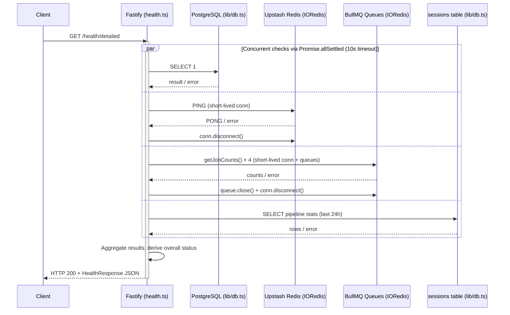

# Design Document: health-detailed-endpoint

## Overview

This feature adds a single `GET /health/detailed` endpoint to the Hearloop API. It returns real-time status for all four critical infrastructure subsystems — PostgreSQL, Redis, BullMQ queue depths, and a 24-hour pipeline summary — in a single JSON response. The endpoint is public (no auth), always returns HTTP 200, and is intended for load balancer health checks, on-call dashboards, and portfolio observability demonstrations.

The entire implementation lives in one new file: `apps/api/src/routes/health.ts`. The only change to existing files is a single `app.register(healthRoutes)` call in `apps/api/src/index.ts`.

### Design Goals

- **No new infrastructure**: reuse the existing `db` Kysely client and the `lib/queue.ts` IORedis/BullMQ patterns.
- **Free-tier safe**: all checks are on-demand per request; no background polling, no persistent connections.
- **Resilient**: a single subsystem failure never prevents the other three checks from reporting.
- **Fast**: all four checks run concurrently via `Promise.allSettled`; a 10-second timeout wraps the whole operation.

---

## Architecture



The route handler orchestrates four independent async check functions. Each check is self-contained: it creates any resources it needs, measures its own latency, handles its own errors, and cleans up in a `finally` block. The handler wraps the entire `Promise.allSettled` call in a `Promise.race` against a 10-second timeout.

---

## Components and Interfaces

### TypeScript Types (`health.ts`)

```typescript
type CheckStatus = 'ok' | 'error';

interface CheckResult {
  status: CheckStatus;
  latencyMs?: number;
  error?: string;
}

interface QueueDepths {
  validate: number;
  transcribe: number;
  analyze: number;
  webhooks: number;
}

interface PipelineStats extends CheckResult {
  completionRate24h?: number;
  avgLatencyMs?: number | null;
  failedLast24h?: number;
}

interface HealthResponse {
  status: 'healthy' | 'degraded';
  checks: {
    database: CheckResult;
    redis: CheckResult;
    queueDepths: QueueDepths | { status: 'error'; error: string };
    pipeline: PipelineStats;
  };
}
```

### Check Functions

Each function is a standalone `async` function with no side effects beyond its own I/O. All are exported for unit testing.

#### `checkDatabase(): Promise<CheckResult>`

```typescript
export async function checkDatabase(): Promise<CheckResult> {
  const start = Date.now();
  try {
    await db.executeQuery(sql`SELECT 1`.compile(db));
    return { status: 'ok', latencyMs: Date.now() - start };
  } catch (err) {
    return {
      status: 'error',
      latencyMs: Date.now() - start,
      error: err instanceof Error ? err.message : String(err),
    };
  }
}
```

Reuses the existing `db` export from `lib/db.ts`. No new pool or connection is created.

#### `checkRedis(): Promise<CheckResult>`

```typescript
export async function checkRedis(): Promise<CheckResult> {
  const conn = new IORedis(process.env.REDIS_URL!, {
    maxRetriesPerRequest: null,
    enableReadyCheck: false,
  });
  try {
    let start = Date.now();
    let response = await conn.ping();
    let latencyMs = Date.now() - start;

    // Re-issue once if latency rounds to zero (cold connection)
    if (latencyMs === 0) {
      start = Date.now();
      response = await conn.ping();
      latencyMs = Date.now() - start;
    }

    if (response !== 'PONG') {
      return { status: 'error', error: `unexpected PING response: ${response}` };
    }
    return { status: 'ok', latencyMs };
  } catch (err) {
    return {
      status: 'error',
      error: err instanceof Error ? err.message : String(err),
    };
  } finally {
    try {
      conn.disconnect();
    } catch (disconnectErr) {
      // If disconnect itself throws, we still return the check result above.
      // The caller will see the result already set; this is a best-effort cleanup.
    }
  }
}
```

Short-lived IORedis connection, always disconnected in `finally`. Matches the pattern in `lib/queue.ts`.

#### `checkQueues(): Promise<QueueDepths | { status: 'error'; error: string }>`

```typescript
export async function checkQueues(): Promise<QueueDepths | { status: 'error'; error: string }> {
  const conn = new IORedis(process.env.REDIS_URL!, {
    maxRetriesPerRequest: null,
    enableReadyCheck: false,
  });

  const QUEUE_NAMES = {
    validate:  'hearloop-validate',
    transcribe: 'hearloop-transcribe',
    analyze:   'hearloop-analyze',
    webhooks:  'hearloop-webhooks',
  } as const;

  const queues = Object.entries(QUEUE_NAMES).map(
    ([key, name]) => ({ key, queue: new Queue(name, { connection: conn }) })
  );

  try {
    const counts = await Promise.all(
      queues.map(({ key, queue }) =>
        queue.getJobCounts().then((c) => ({ key, waiting: c.waiting ?? 0 }))
      )
    );
    return counts.reduce(
      (acc, { key, waiting }) => ({ ...acc, [key]: waiting }),
      {} as QueueDepths
    );
  } catch (err) {
    return {
      status: 'error',
      error: err instanceof Error ? err.message : String(err),
    };
  } finally {
    await Promise.allSettled(queues.map(({ queue }) => queue.close()));
    conn.disconnect();
  }
}
```

All four `Queue` instances share one short-lived IORedis connection (read-only `getJobCounts` does not use blocking commands, so sharing is safe here). All queues are closed and the connection disconnected in `finally`.

#### `checkPipeline(): Promise<PipelineStats>`

```typescript
export async function checkPipeline(): Promise<PipelineStats> {
  try {
    const row = await db
      .selectFrom('sessions')
      .select([
        db.fn.count<number>('id').as('total'),
        db.fn.count<number>('id')
          .filterWhere('status', '=', 'completed')
          .as('completed'),
        db.fn.count<number>('id')
          .filterWhere('status', '=', 'failed')
          .as('failed'),
        sql<number | null>`AVG(
          EXTRACT(EPOCH FROM (processing_completed_at - processing_started_at)) * 1000
        ) FILTER (
          WHERE status = 'completed'
          AND processing_started_at IS NOT NULL
          AND processing_completed_at IS NOT NULL
        )`.as('avg_latency_ms'),
      ])
      .where('created_at', '>=', sql`NOW() - INTERVAL '24 hours'`)
      .executeTakeFirstOrThrow();

    const total = Number(row.total);
    const completed = Number(row.completed);
    const failed = Number(row.failed);

    const completionRate24h =
      total === 0 ? 1.0 : Math.round((completed / total) * 100) / 100;

    const avgLatencyMs =
      row.avg_latency_ms != null ? Math.round(Number(row.avg_latency_ms)) : null;

    return {
      status: 'ok',
      completionRate24h,
      avgLatencyMs,
      failedLast24h: failed,
    };
  } catch (err) {
    return {
      status: 'error',
      error: err instanceof Error ? err.message : String(err),
    };
  }
}
```

Uses the existing `db` client. The `FILTER (WHERE ...)` aggregate syntax is standard PostgreSQL 9.4+ and supported by Neon.

### Route Handler and Timeout Orchestration

```typescript
const HEALTH_TIMEOUT_MS = 10_000;

function withTimeout<T>(
  promise: Promise<T>,
  ms: number,
  fallback: T
): Promise<T> {
  return Promise.race([
    promise,
    new Promise<T>((resolve) => setTimeout(() => resolve(fallback), ms)),
  ]);
}

export async function healthRoutes(app: FastifyInstance): Promise<void> {
  app.get('/health/detailed', async (_req, reply) => {
    const timeoutResult: CheckResult = { status: 'error', error: 'timeout' };

    const [dbResult, redisResult, queuesResult, pipelineResult] =
      await withTimeout(
        Promise.allSettled([
          checkDatabase(),
          checkRedis(),
          checkQueues(),
          checkPipeline(),
        ]),
        HEALTH_TIMEOUT_MS,
        // If the whole allSettled times out, all four checks get the timeout result
        [
          { status: 'fulfilled', value: timeoutResult },
          { status: 'fulfilled', value: timeoutResult },
          { status: 'fulfilled', value: timeoutResult },
          { status: 'fulfilled', value: timeoutResult },
        ] as PromiseSettledResult<CheckResult>[]
      );

    const database = dbResult.status === 'fulfilled'
      ? dbResult.value
      : { status: 'error' as const, error: String((dbResult as PromiseRejectedResult).reason) };

    const redis = redisResult.status === 'fulfilled'
      ? redisResult.value
      : { status: 'error' as const, error: String((redisResult as PromiseRejectedResult).reason) };

    const queueDepths = queuesResult.status === 'fulfilled'
      ? queuesResult.value
      : { status: 'error' as const, error: String((queuesResult as PromiseRejectedResult).reason) };

    const pipeline = pipelineResult.status === 'fulfilled'
      ? pipelineResult.value as PipelineStats
      : { status: 'error' as const, error: String((pipelineResult as PromiseRejectedResult).reason) };

    const isHealthy =
      database.status === 'ok' &&
      redis.status === 'ok' &&
      !('status' in queueDepths && queueDepths.status === 'error') &&
      pipeline.status === 'ok';

    const body: HealthResponse = {
      status: isHealthy ? 'healthy' : 'degraded',
      checks: { database, redis, queueDepths, pipeline },
    };

    return reply.code(200).send(body);
  });
}
```

**Design decision — timeout strategy**: The `withTimeout` wrapper races the entire `Promise.allSettled` against a single 10-second timer. This is simpler than per-check timeouts and matches the requirement ("complete and respond within 10 seconds"). If the whole batch times out, all four checks receive `{ status: 'error', error: 'timeout' }`. Individual checks that complete before the timeout still contribute their real results because `Promise.allSettled` never rejects.

### Route Registration (`index.ts`)

One line added after the existing route registrations:

```typescript
import { healthRoutes } from './routes/health';

// In start():
await app.register(healthRoutes); // no prefix — matches existing /health at root
```

No prefix is used, consistent with the existing `app.get('/health', ...)` registration pattern.

---

## Data Models

No new database tables or schema changes. The feature reads from the existing `sessions` table using the existing `db` Kysely client.

### Sessions Table Fields Used

| Column | Type | Used for |
|---|---|---|
| `id` | `string` | COUNT aggregate |
| `status` | `string` | Filter for `completed` / `failed` |
| `created_at` | `Date` | 24-hour window filter |
| `processing_started_at` | `Date \| null` | Average latency calculation |
| `processing_completed_at` | `Date \| null` | Average latency calculation |

### Response Shape

```typescript
// Success (all checks pass)
{
  "status": "healthy",
  "checks": {
    "database": { "status": "ok", "latencyMs": 12 },
    "redis": { "status": "ok", "latencyMs": 4 },
    "queueDepths": { "validate": 0, "transcribe": 0, "analyze": 2, "webhooks": 0 },
    "pipeline": { "status": "ok", "completionRate24h": 0.94, "avgLatencyMs": 3200, "failedLast24h": 2 }
  }
}

// Degraded (one or more checks fail)
{
  "status": "degraded",
  "checks": {
    "database": { "status": "error", "error": "connect ECONNREFUSED", "latencyMs": 5001 },
    "redis": { "status": "ok", "latencyMs": 4 },
    "queueDepths": { "validate": 0, "transcribe": 0, "analyze": 2, "webhooks": 0 },
    "pipeline": { "status": "ok", "completionRate24h": 1.0, "avgLatencyMs": null, "failedLast24h": 0 }
  }
}
```

---

## Correctness Properties

*A property is a characteristic or behavior that should hold true across all valid executions of a system — essentially, a formal statement about what the system should do. Properties serve as the bridge between human-readable specifications and machine-verifiable correctness guarantees.*

This feature involves a Fastify route with external I/O (database, Redis, BullMQ). The check functions themselves contain pure computation logic (pipeline stats aggregation, latency measurement, status derivation) that is well-suited to property-based testing. The I/O layer is tested with mocks.

**Property Reflection**: After reviewing all testable criteria, the following consolidations were made:
- 1.2 (HTTP 200 always) and 1.4 (degraded when any check errors) are both covered by a single "status derivation" property that tests all combinations.
- 2.3 and 3.3 (latency measurement) are combined into one latency property since the pattern is identical.
- 3.4 and 4.2 (connection cleanup) are combined into one resource cleanup property.
- 5.2, 5.3, 5.4 (pipeline computation) are combined into one pipeline stats property since they all test the same pure computation function.
- 6.1 (error isolation) is a distinct property worth keeping separate.

---

### Property 1: Overall status derivation

*For any* combination of check results (database, redis, queueDepths, pipeline), the derived `status` field is `"healthy"` if and only if all four checks have `status: "ok"` (or queueDepths is a valid depth object with no error field), and `"degraded"` otherwise. The HTTP response code is always 200 regardless of check outcomes.

**Validates: Requirements 1.2, 1.4**

---

### Property 2: Response shape invariant

*For any* combination of mocked check outcomes (any mix of ok/error results for all four checks), the response body always contains exactly the fields `status`, `checks.database`, `checks.redis`, `checks.queueDepths`, and `checks.pipeline`, each with the correct type.

**Validates: Requirements 1.5**

---

### Property 3: Latency measurement non-negativity

*For any* simulated check duration (including zero-duration and long-duration cases), the `latencyMs` field returned by `checkDatabase()` and `checkRedis()` is always a non-negative integer, and is always present in both the success and error result shapes.

**Validates: Requirements 2.3, 3.3**

---

### Property 4: Connection cleanup invariant

*For any* outcome of `checkRedis()` or `checkQueues()` (success, PING failure, throw, disconnect error), the short-lived IORedis connection's `disconnect()` method is always called, and for `checkQueues()`, all Queue instances' `close()` methods are always called.

**Validates: Requirements 3.4, 4.2, 7.3**

---

### Property 5: Pipeline stats computation

*For any* list of session rows returned by the database (with any combination of statuses, timestamps, and counts), the `checkPipeline()` function computes:
- `completionRate24h` = `round(completed / total, 2)`, or `1.0` when `total === 0`
- `avgLatencyMs` = arithmetic mean of `(processing_completed_at - processing_started_at)` in ms for completed sessions with both timestamps, or `null` when no such sessions exist
- `failedLast24h` = count of sessions with `status === 'failed'`

**Validates: Requirements 5.2, 5.3, 5.4**

---

### Property 6: Error isolation

*For any* single check that throws an unhandled exception, the response still contains all four check fields, the throwing check's field has `status: "error"`, and the other three check fields are unaffected by the failure.

**Validates: Requirements 6.1**

---

## Error Handling

### Per-check error handling

Each check function catches all errors internally and returns a `CheckResult` with `status: 'error'`. Errors never propagate to the route handler — the handler only sees settled `PromiseSettledResult` values from `Promise.allSettled`.

| Check | Error scenario | Response |
|---|---|---|
| Database | Query throws (connection refused, timeout, Neon cold start) | `{ status: 'error', error: '<message>', latencyMs: <n> }` |
| Redis | PING throws, returns non-PONG, or disconnect throws | `{ status: 'error', error: '<message>' }` |
| Queues | Any `getJobCounts()` throws | `{ status: 'error', error: '<message>' }` |
| Pipeline | SQL query throws | `{ status: 'error', error: '<message>' }` |
| Any check | Does not resolve within 10 seconds | `{ status: 'error', error: 'timeout' }` |

### Resource cleanup

All short-lived connections are disconnected in `finally` blocks. If `conn.disconnect()` itself throws in `checkRedis()`, the error is swallowed (best-effort cleanup) — the check result has already been determined at that point. For `checkQueues()`, `Promise.allSettled` is used to close all queues so one failing close does not prevent others from closing.

### Timeout

The 10-second timeout is implemented as a `Promise.race` between `Promise.allSettled([...checks])` and a `setTimeout` that resolves with all-timeout results. This means:
- If all checks complete in < 10s, the real results are returned.
- If the batch has not completed by 10s, all four checks receive `{ status: 'error', error: 'timeout' }` and the response is sent immediately.

This is a conservative approach: a single slow check causes all checks to report timeout. An alternative would be per-check timeouts, but that adds complexity without meaningful benefit given the 10s budget is generous for all four checks combined.

---

## Testing Strategy

This feature involves a Fastify route with external I/O. Property-based testing applies to the pure computation layer (pipeline stats, status derivation, latency measurement). The I/O layer is covered by unit tests with mocks and a single integration smoke test.

### Unit Tests (with mocks)

Test each check function in isolation by mocking `db`, `IORedis`, and `Queue`.

**`checkDatabase()`**
- Success: mock `db.executeQuery` to resolve; verify `{ status: 'ok', latencyMs: <n> }` where `latencyMs >= 0`
- Error: mock `db.executeQuery` to throw; verify `{ status: 'error', error: '<message>', latencyMs: <n> }`

**`checkRedis()`**
- Success: mock `IORedis` to return `'PONG'`; verify `{ status: 'ok', latencyMs: <n> }`
- Zero-latency retry: mock to return `'PONG'` with zero elapsed time; verify `ping()` is called twice
- Non-PONG response: mock to return `'LOADING'`; verify `{ status: 'error', error: '...' }`
- Throw: mock `ping()` to throw; verify `{ status: 'error', error: '<message>' }`
- Cleanup: verify `conn.disconnect()` is called in all cases (success, error, throw)

**`checkQueues()`**
- Success: mock all four queues to return known counts; verify depth object maps `waiting` correctly
- Partial failure: mock one queue to throw; verify `{ status: 'error', error: '<message>' }`
- Cleanup: verify `queue.close()` and `conn.disconnect()` are called in all cases

**`checkPipeline()`**
- Success: mock `db` to return known row; verify all three computed fields
- Zero sessions: mock `total = 0`; verify `completionRate24h = 1.0`
- No completed sessions with timestamps: verify `avgLatencyMs = null`
- Throw: mock `db` to throw; verify `{ status: 'error', error: '<message>' }`

**Route handler**
- All checks ok: verify `status: 'healthy'`
- One check errors: verify `status: 'degraded'`, HTTP 200
- All checks error: verify `status: 'degraded'`, HTTP 200
- Timeout: mock all checks to never resolve; verify timeout result after 10s

### Property-Based Tests

Use a property-based testing library (e.g., `fast-check` for TypeScript/Node.js). Configure each test to run a minimum of 100 iterations.

**Property 1 — Status derivation** (`Feature: health-detailed-endpoint, Property 1: overall status derivation`)
Generate arbitrary combinations of `CheckResult` values for all four checks. Assert that the derived `status` is `'healthy'` iff all checks are ok, and `'degraded'` otherwise. Assert HTTP status is always 200.

**Property 2 — Response shape invariant** (`Feature: health-detailed-endpoint, Property 2: response shape invariant`)
Generate arbitrary check outcomes. Assert the response always contains all required top-level and nested fields with correct types.

**Property 3 — Latency non-negativity** (`Feature: health-detailed-endpoint, Property 3: latency measurement non-negativity`)
Generate arbitrary simulated durations (0ms to 5000ms). Assert `latencyMs >= 0` and is present in both success and error results from `checkDatabase()` and `checkRedis()`.

**Property 4 — Connection cleanup** (`Feature: health-detailed-endpoint, Property 4: connection cleanup invariant`)
Generate arbitrary outcomes (success, various error types). Assert `conn.disconnect()` is always called for `checkRedis()`, and both `queue.close()` and `conn.disconnect()` are always called for `checkQueues()`.

**Property 5 — Pipeline stats computation** (`Feature: health-detailed-endpoint, Property 5: pipeline stats computation`)
Generate arbitrary arrays of session rows with random statuses and timestamps. Assert `completionRate24h`, `avgLatencyMs`, and `failedLast24h` match the expected formulas. Include the zero-total edge case in the generator.

**Property 6 — Error isolation** (`Feature: health-detailed-endpoint, Property 6: error isolation`)
Generate a random index (0–3) indicating which check throws. Assert the response contains all four check fields, the throwing check has `status: 'error'`, and the other three checks have their expected values.

### Integration Smoke Test

Hit the live endpoint (or a locally running server) with no auth header:

```bash
curl -s http://localhost:3001/health/detailed | jq .
```

Assert:
- HTTP 200
- Response body has `status` field (`"healthy"` or `"degraded"`)
- `checks.database`, `checks.redis`, `checks.queueDepths`, `checks.pipeline` all present
- No auth required (no `Authorization` header sent)

This test is not run in CI by default (requires live infrastructure) but can be run manually after deployment.
