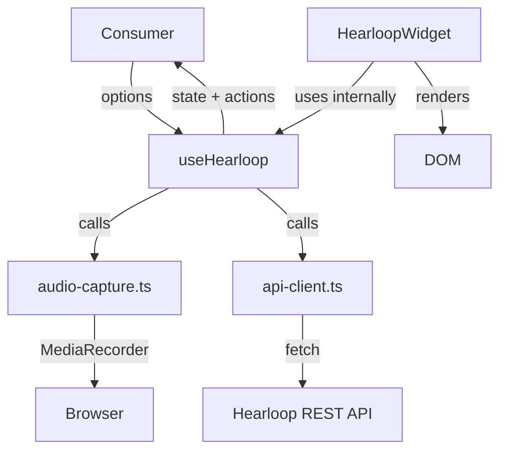
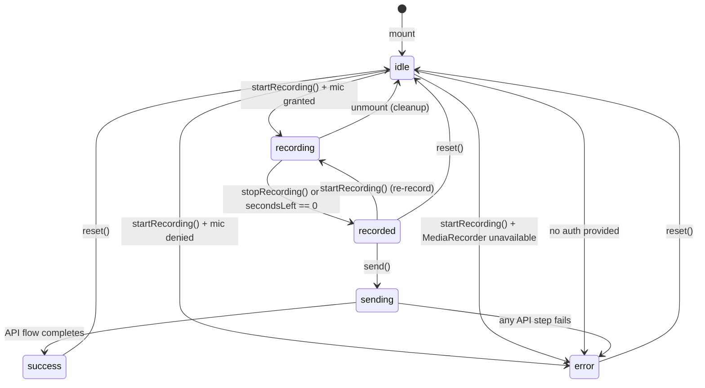

# Design Document — `@hearloop/react`

## Overview

`@hearloop/react` is a zero-dependency React SDK that ports the full Hearloop voice-feedback flow from `widget.js` into a headless hook (`useHearloop`) and a default UI component (`HearloopWidget`). Partners who already use React can drop in a single JSX line instead of managing a `<script>` tag.

The SDK lives at `packages/react/` inside the existing npm workspaces + Turborepo monorepo. It ships CommonJS, ESM, and TypeScript declaration outputs via `tsup`, treats `react` and `react-dom` as peer dependencies, and adds zero runtime dependencies to the host application.

### Design Goals

1. **Faithful port** — the 5-step API flow from `widget.js` is reproduced exactly, including the `sessionCreateToken` security model.
2. **Headless-first** — `useHearloop` owns all state and side effects; `HearloopWidget` is a thin consumer of the hook.
3. **Single responsibility per file** — each file does one job (hook logic, component rendering, types, API client, audio capture).
4. **No SSR footguns** — `"use client"` directive on every file that touches browser APIs; documented `ssr: false` pattern for Next.js.
5. **Measurable** — bundle size (ESM, CJS) and first-render cost are tracked in `context/METRICS.md`.

---

## Architecture

The package is structured as three layers:

```
packages/react/src/
  types.ts          — all exported TypeScript types (one job: types)
  api-client.ts     — fetch wrappers for the 5-step Hearloop API flow (one job: HTTP)
  audio-capture.ts  — MediaRecorder lifecycle helpers (one job: audio)
  use-hearloop.ts   — useHearloop hook (one job: state machine)
  widget.tsx        — HearloopWidget component (one job: default UI)
  index.ts          — re-exports only (one job: package entry point)
```

Each file maps to exactly one concern, following the single-responsibility rule in the workspace steering file.

### Data Flow



### State Machine

The hook implements a strict state machine. Transitions are the only way state changes — there is no ad-hoc `setState` outside the machine.



---

## Components and Interfaces

### `useHearloop(options: UseHearloopOptions): UseHearloopReturn`

The hook is the core of the SDK. It owns:
- State machine transitions
- MediaRecorder lifecycle (start, stop, cleanup on unmount)
- Countdown timer
- API flow execution
- Error handling

It exposes a stable, referentially-stable action surface via `useCallback` so consumers can safely pass actions as props without triggering re-renders.

**Returned surface:**

| Field | Type | Description |
|---|---|---|
| `state` | `HearloopState` | Current phase of the lifecycle |
| `startRecording` | `() => Promise<void>` | Request mic + start MediaRecorder |
| `stopRecording` | `() => void` | Stop MediaRecorder + release mic |
| `send` | `() => Promise<void>` | Execute 5-step API flow |
| `reset` | `() => void` | Return to idle, clear blob + error |
| `audioBlob` | `Blob \| null` | Recorded audio, available after `recorded` |
| `secondsLeft` | `number` | Countdown, starts at `maxDurationSec` |
| `error` | `string \| null` | Error message, set on transition to `error` |

### `HearloopWidget(props: HearloopWidgetProps)`

A floating-action-button + collapsible panel component. It calls `useHearloop` internally and renders state-driven UI. It accepts all `UseHearloopOptions` fields plus visual overrides (`position`, `accentColor`, `className`).

The component uses inline `<style>` injection (matching the `widget.js` and `Recorder.tsx` patterns already in the codebase) rather than a CSS-in-JS library, keeping the zero-dependency constraint.

### `api-client.ts` — Internal API Client

Encapsulates all five HTTP steps. Each step is a separate async function so they can be tested and reasoned about independently.

```typescript
// Internal — not exported from package entry
async function getSessionCreateToken(apiBaseUrl: string, apiKey: string): Promise<string>
async function createSession(apiBaseUrl: string, token: string, opts: SessionCreateOpts): Promise<{ sessionId: string; sessionToken: string }>
async function openSession(apiBaseUrl: string, sessionToken: string): Promise<void>
async function getUploadUrl(apiBaseUrl: string, sessionToken: string, mimeType: string): Promise<{ uploadUrl: string; storageKey: string }>
async function uploadAudio(uploadUrl: string, blob: Blob, mimeType: string): Promise<void>
async function finalizeSession(apiBaseUrl: string, sessionToken: string, storageKey: string, mimeType: string, sizeBytes: number): Promise<void>
```

A single orchestrator function `runApiFlow` calls these in sequence and is what `useHearloop` invokes on `send()`.

### `audio-capture.ts` — Internal Audio Helpers

```typescript
// Internal — not exported from package entry
function selectMimeType(): string   // 'audio/webm' if supported, else 'audio/mp4'
function createMediaRecorder(stream: MediaStream, mimeType: string): MediaRecorder
```

The MIME type selection and fallback logic lives here, isolated from the hook.

---

## Data Models

### `HearloopState`

```typescript
export type HearloopState =
  | "idle"
  | "recording"
  | "recorded"
  | "sending"
  | "success"
  | "error";
```

### `UseHearloopOptions`

```typescript
export interface UseHearloopOptions {
  /** Pre-fetched server-side token. Preferred over apiKey for client-rendered apps. */
  sessionCreateToken?: string;
  /** Raw API key. Only appropriate for server-side contexts. */
  apiKey?: string;
  /** Prompt shown to the user. Default: "How was your experience today?" */
  promptText?: string;
  /** Maximum recording duration in seconds. Default: 5 */
  maxDurationSec?: number;
  /** Override the API base URL. Default: "https://18-223-189-193.nip.io/v1" */
  apiBaseUrl?: string;
}
```

### `UseHearloopReturn`

```typescript
export interface UseHearloopReturn {
  state: HearloopState;
  startRecording: () => Promise<void>;
  stopRecording: () => void;
  send: () => Promise<void>;
  reset: () => void;
  audioBlob: Blob | null;
  secondsLeft: number;
  error: string | null;
}
```

### `HearloopWidgetProps`

```typescript
export interface HearloopWidgetProps extends UseHearloopOptions {
  /** FAB placement. Default: "bottom-right" */
  position?: "bottom-right" | "bottom-left";
  /** Accent color applied to FAB, mic icon, and send button. Default: "#1D9E75" */
  accentColor?: string;
  /** Optional className applied to the root wrapper div */
  className?: string;
}
```

### Internal: `SessionCreateOpts`

```typescript
// Internal to api-client.ts — not exported
interface SessionCreateOpts {
  promptText: string;
  maxDurationSec: number;
}
```

### Package Entry Point (`index.ts`)

```typescript
export type { HearloopState, UseHearloopOptions, UseHearloopReturn, HearloopWidgetProps } from "./types";
export { useHearloop } from "./use-hearloop";
export { HearloopWidget } from "./widget";
```

The build will fail if any of the five required exports are missing (enforced by `tsup` entry point + TypeScript strict mode).

### `tsup.config.ts`

```typescript
import { defineConfig } from "tsup";

export default defineConfig({
  entry: ["src/index.ts"],
  format: ["cjs", "esm"],
  dts: true,
  sourcemap: true,
  clean: true,
  external: ["react", "react-dom"],
});
```

`package.json` exports map:

```json
{
  "main": "./dist/index.js",
  "module": "./dist/index.mjs",
  "types": "./dist/index.d.ts",
  "exports": {
    ".": {
      "import": "./dist/index.mjs",
      "require": "./dist/index.js",
      "types": "./dist/index.d.ts"
    }
  }
}
```

---

## Correctness Properties

*A property is a characteristic or behavior that should hold true across all valid executions of a system — essentially, a formal statement about what the system should do. Properties serve as the bridge between human-readable specifications and machine-verifiable correctness guarantees.*

This feature involves pure state-machine logic, input validation, and data transformation — all well-suited to property-based testing. The API flow and audio capture involve I/O, but the state machine transitions and validation logic are pure functions that can be tested with generated inputs.

The property-based testing library used is **fast-check** (already a devDependency in `apps/api/package.json`; will be added to `packages/react/` devDependencies).

### Property 1: Initial state reflects options defaults

*For any* `UseHearloopOptions` object (including partial objects with omitted optional fields), when `useHearloop` mounts, `state` SHALL be `"idle"`, `secondsLeft` SHALL equal `maxDurationSec` when provided or `5` when omitted, and `audioBlob` and `error` SHALL both be `null`.

**Validates: Requirements 3.1, 4.1**

### Property 2: Reset always restores idle invariant

*For any* `HearloopState` value and any `UseHearloopOptions`, calling `reset()` SHALL transition `state` to `"idle"`, set `audioBlob` to `null`, set `error` to `null`, and set `secondsLeft` to `maxDurationSec` (or `5` if not provided) — regardless of which state the hook was in before `reset()` was called.

**Validates: Requirements 3.6**

### Property 3: Missing auth always produces error without network calls

*For any* `UseHearloopOptions` where both `sessionCreateToken` and `apiKey` are absent, undefined, or empty strings, calling `send()` SHALL transition to `"error"` with a non-empty error message and SHALL make zero network requests.

**Validates: Requirements 2.5**

### Property 4: Auth routing is determined solely by which credential is present

*For any* non-empty `sessionCreateToken` string, calling `send()` SHALL never call `POST /public/sessions/create-token`. *For any* non-empty `apiKey` string (with no `sessionCreateToken`), calling `send()` SHALL call `POST /public/sessions/create-token` exactly once with that `apiKey` in the request body.

**Validates: Requirements 2.2, 2.3**

### Property 5: MIME type selection is deterministic and exhaustive

*For any* browser environment state, `selectMimeType()` SHALL return a value that is a member of `{"audio/webm", "audio/mp4"}` — never any other string — and SHALL return `"audio/webm"` if and only if `MediaRecorder.isTypeSupported("audio/webm")` returns `true`.

**Validates: Requirements 4.4**

### Property 6: Countdown is bounded and triggers auto-stop

*For any* `maxDurationSec` value `n` where `n ≥ 1`, during a recording session `secondsLeft` SHALL start at `n`, decrement by exactly `1` per elapsed second, never go below `0`, and the hook SHALL automatically transition to `"recorded"` when `secondsLeft` reaches `0`.

**Validates: Requirements 3.4, 4.2**

### Property 7: audioBlob is preserved intact through any API failure

*For any* `Blob` captured during recording, if any step of the 5-step API flow throws or returns a non-OK response, the hook SHALL transition to `"error"` and `audioBlob` SHALL remain reference-equal to the blob that was captured — it SHALL NOT be set to `null` or replaced.

**Validates: Requirements 3.8**

### Property 8: Widget forwards all UseHearloopOptions fields unchanged

*For any* `UseHearloopOptions` object passed as props to `HearloopWidget`, every field (`sessionCreateToken`, `apiKey`, `promptText`, `maxDurationSec`, `apiBaseUrl`) SHALL be forwarded to the internal `useHearloop` call with the same value — no field SHALL be dropped, defaulted differently, or mutated by the widget layer.

**Validates: Requirements 5.4**

---

## Error Handling

### Error Categories and Messages

| Trigger | Error Message | State Transition |
|---|---|---|
| No auth provided | `"No authentication provided. Pass sessionCreateToken or apiKey."` | `idle → error` (on `send()`) |
| Mic denied | `"Microphone access denied. Please allow mic access and try again."` | `idle → error` |
| MediaRecorder unavailable | `"MediaRecorder is not supported in this browser."` | `idle → error` (on `startRecording()`) |
| `create-token` API fails | `"Failed to get session token. Check your API key."` | `sending → error` |
| `create session` fails | `"Failed to create session."` | `sending → error` |
| `open session` fails | `"Failed to open session."` | `sending → error` |
| `upload-url` fails | `"Failed to get upload URL."` | `sending → error` |
| S3 upload fails | `"Audio upload failed."` | `sending → error` |
| `finalize` fails | `"Failed to finalize session."` | `sending → error` |
| Unknown error | `"Something went wrong. Please try again."` | `sending → error` |

### Error Recovery

- `audioBlob` is preserved on API errors so the user can call `send()` again without re-recording.
- `reset()` clears `error` and `audioBlob` and returns to `idle`.
- Mic errors require the user to call `startRecording()` again (which re-requests mic permission).

### Cleanup on Unmount

`useHearloop` registers a `useEffect` cleanup that:
1. Calls `mediaRecorder.stop()` if state is `recording`
2. Calls `stream.getTracks().forEach(t => t.stop())` to release the mic
3. Clears the countdown `setInterval`

This prevents resource leaks when the component unmounts mid-recording (e.g., route navigation in Next.js).

### MIME Type Fallback

If `audio/webm` is selected but `MediaRecorder` throws at runtime, the hook catches the error and retries with `audio/mp4`. This is handled inside `audio-capture.ts` and is transparent to the hook's state machine.

---

## Testing Strategy

### Dual Testing Approach

Unit tests cover specific examples and error conditions. Property-based tests verify universal invariants across generated inputs. Both are needed — unit tests catch concrete bugs, property tests verify general correctness.

### Test File Layout

```
packages/react/src/
  __tests__/
    use-hearloop.test.ts     — hook state machine (unit + property)
    api-client.test.ts       — API flow steps (unit, mocked fetch)
    audio-capture.test.ts    — MIME selection, MediaRecorder helpers (unit + property)
    widget.test.tsx          — HearloopWidget rendering (unit, React Testing Library)
    types.test.ts            — TypeScript compile-time checks (tsd or expect-type)
```

### Property-Based Tests

Uses **fast-check** (`fc`) with a minimum of **100 iterations** per property test.

Each property test is tagged with a comment referencing the design property:
```typescript
// Feature: react-sdk, Property 2: Reset always returns to idle
```

**Property 1 — Initial state reflects options defaults:**
```typescript
// Feature: react-sdk, Property 1: Initial state reflects options defaults
fc.assert(fc.property(
  fc.record({
    maxDurationSec: fc.option(fc.integer({ min: 1, max: 60 })),
    promptText: fc.option(fc.string()),
  }),
  (opts) => {
    const { result } = renderHook(() => useHearloop(opts));
    expect(result.current.state).toBe("idle");
    expect(result.current.secondsLeft).toBe(opts.maxDurationSec ?? 5);
    expect(result.current.audioBlob).toBeNull();
    expect(result.current.error).toBeNull();
  }
), { numRuns: 100 });
```

**Property 2 — Reset always restores idle invariant:**
```typescript
// Feature: react-sdk, Property 2: Reset always restores idle invariant
fc.assert(fc.property(
  fc.constantFrom("idle", "recorded", "error", "success"),
  fc.record({ maxDurationSec: fc.integer({ min: 1, max: 60 }) }),
  (startState, opts) => {
    const { result } = renderHook(() => useHearloop(opts));
    // Drive hook to startState, then reset
    act(() => result.current.reset());
    expect(result.current.state).toBe("idle");
    expect(result.current.audioBlob).toBeNull();
    expect(result.current.error).toBeNull();
    expect(result.current.secondsLeft).toBe(opts.maxDurationSec ?? 5);
  }
), { numRuns: 100 });
```

**Property 3 — Missing auth produces error without network calls:**
```typescript
// Feature: react-sdk, Property 3: Missing auth always produces error without network calls
fc.assert(fc.property(
  fc.record({
    promptText: fc.option(fc.string()),
    maxDurationSec: fc.option(fc.integer({ min: 1, max: 60 })),
    // Explicitly no sessionCreateToken or apiKey
  }),
  async (opts) => {
    const fetchSpy = jest.spyOn(global, "fetch");
    const { result } = renderHook(() => useHearloop(opts));
    await act(() => result.current.send());
    expect(result.current.state).toBe("error");
    expect(result.current.error).toBeTruthy();
    expect(fetchSpy).not.toHaveBeenCalled();
    fetchSpy.mockRestore();
  }
), { numRuns: 100 });
```

**Property 4 — Auth routing is determined solely by which credential is present:**
```typescript
// Feature: react-sdk, Property 4: Auth routing determined by credential presence
fc.assert(fc.property(
  fc.string({ minLength: 1 }), // sessionCreateToken
  async (token) => {
    const fetchMock = jest.fn().mockResolvedValue({ ok: true, json: async () => ({}) });
    global.fetch = fetchMock;
    const { result } = renderHook(() => useHearloop({ sessionCreateToken: token }));
    // ... drive to recorded state, call send()
    const createTokenCalls = fetchMock.mock.calls.filter(
      ([url]) => String(url).includes("create-token")
    );
    expect(createTokenCalls).toHaveLength(0);
  }
), { numRuns: 100 });
```

**Property 5 — MIME type selection is deterministic and exhaustive:**
```typescript
// Feature: react-sdk, Property 5: MIME type selection is deterministic and exhaustive
fc.assert(fc.property(
  fc.boolean(), // simulates MediaRecorder.isTypeSupported('audio/webm')
  (webmSupported) => {
    const mimeType = selectMimeType(webmSupported);
    expect(["audio/webm", "audio/mp4"]).toContain(mimeType);
    if (webmSupported) expect(mimeType).toBe("audio/webm");
    else expect(mimeType).toBe("audio/mp4");
  }
), { numRuns: 100 });
```

**Property 6 — Countdown is bounded and triggers auto-stop:**
```typescript
// Feature: react-sdk, Property 6: Countdown is bounded and triggers auto-stop
fc.assert(fc.property(
  fc.integer({ min: 1, max: 30 }),
  (maxDurationSec) => {
    let secondsLeft = maxDurationSec;
    const snapshots: number[] = [];
    for (let i = 0; i < maxDurationSec + 5; i++) {
      if (secondsLeft > 0) secondsLeft--;
      snapshots.push(secondsLeft);
    }
    expect(snapshots.every(s => s >= 0)).toBe(true);
    expect(snapshots[maxDurationSec - 1]).toBe(0); // auto-stop fires at tick n
  }
), { numRuns: 100 });
```

**Property 7 — audioBlob is preserved intact through any API failure:**
```typescript
// Feature: react-sdk, Property 7: audioBlob preserved intact through any API failure
fc.assert(fc.property(
  fc.uint8Array({ minLength: 1, maxLength: 1000 }),
  fc.integer({ min: 0, max: 4 }), // which of the 5 steps fails (0-indexed)
  async (audioData, failingStep) => {
    const blob = new Blob([audioData], { type: "audio/webm" });
    let callCount = 0;
    global.fetch = jest.fn().mockImplementation(() => {
      if (callCount++ === failingStep) return Promise.resolve({ ok: false });
      return Promise.resolve({ ok: true, json: async () => ({ sessionCreateToken: "t", sessionId: "s", sessionToken: "st", uploadUrl: "u", storageKey: "k" }) });
    });
    const { result } = renderHook(() => useHearloop({ sessionCreateToken: "tok" }));
    // Inject blob into recorded state, call send()
    await act(() => result.current.send());
    expect(result.current.state).toBe("error");
    expect(result.current.audioBlob).toBe(blob);
  }
), { numRuns: 100 });
```

**Property 8 — Widget forwards all UseHearloopOptions fields unchanged:**
```typescript
// Feature: react-sdk, Property 8: Widget forwards all UseHearloopOptions fields unchanged
fc.assert(fc.property(
  fc.record({
    promptText: fc.string(),
    maxDurationSec: fc.integer({ min: 1, max: 60 }),
    sessionCreateToken: fc.string({ minLength: 1 }),
  }),
  (opts) => {
    const hookSpy = jest.fn().mockReturnValue({
      state: "idle", startRecording: jest.fn(), stopRecording: jest.fn(),
      send: jest.fn(), reset: jest.fn(), audioBlob: null, secondsLeft: 5, error: null,
    });
    // Render HearloopWidget with opts, verify hookSpy called with same opts
    render(<HearloopWidget {...opts} />);
    expect(hookSpy).toHaveBeenCalledWith(expect.objectContaining(opts));
  }
), { numRuns: 100 });
```

### Unit Tests

- **`api-client.test.ts`**: Each of the 5 API steps tested with mocked `fetch`. Verifies correct URL construction, headers, body shape, and error propagation.
- **`widget.test.tsx`**: Renders `HearloopWidget` in each state (mocking `useHearloop`), verifies correct aria-labels, button disabled states, and text content.
- **`types.test.ts`**: Uses `tsd` or `expect-type` to assert that unknown props on `HearloopWidget` produce TypeScript compile errors.

### Test Runner

```bash
# From monorepo root (following jest-test-patterns.md)
node_modules/.bin/jest --runInBand --rootDir packages/react
```

The `packages/react/package.json` will include:
```json
{
  "scripts": {
    "test": "jest --runInBand",
    "test:run": "jest --runInBand --passWithNoTests"
  }
}
```

### Metrics to Capture

Per the `measure-everything.md` steering rule, the following will be recorded in `context/METRICS.md` after implementation:

| Metric | How measured |
|---|---|
| ESM bundle size (gzipped) | `tsup` output + `gzip -c dist/index.mjs \| wc -c` |
| CJS bundle size (gzipped) | `gzip -c dist/index.js \| wc -c` |
| TypeScript declaration size | `wc -c dist/index.d.ts` |
| First render cost (ms) | React DevTools Profiler on `HearloopWidget` mount |
