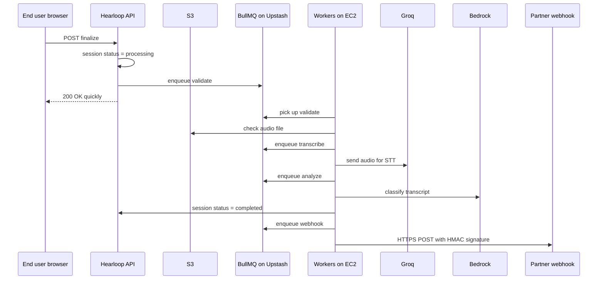
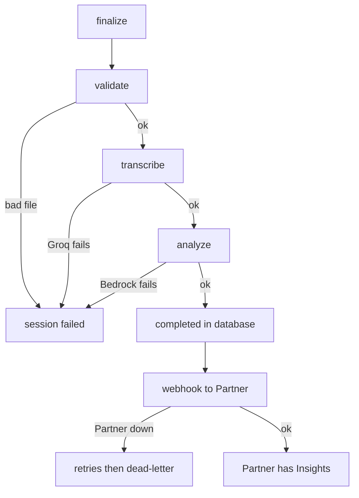

# Coverage #3 — End-to-end flows

**Status:** self-study draft — review before lock / Notion

**How to use this doc:** Read top → bottom once with the scenario in mind. Skip the interview script until the steps feel obvious.

---

## Running scenario (keep this in mind)

**Partner:** QuickLube Auto — a local oil-change shop. They signed up for Hearloop and pasted the widget on their “thank you” page.

**End user:** Maria just paid for an oil change. On her phone she sees: “Tell us how we did — tap and speak.”

**Goal:** Maria should be done in ~5 seconds. QuickLube’s systems should later get JSON they can act on (sentiment, topics like wait time), not a raw audio file to listen to manually.

---

## Diagrams (structure at a glance)

**After finalize (processing pipeline):**

**Failure branches (simplified):**

More detail: [`../diagrams/pipeline-async.md`](../diagrams/pipeline-async.md), [`../diagrams/e2e-failure-paths.md`](../diagrams/e2e-failure-paths.md).

---

## Part A — Capture (before the async pipeline)

These steps happen while Maria is still on the page. Nothing is transcribed yet.

### Step 1 — Partner sets up Hearloop

**What happens**  
QuickLube registers as a **Partner**. They get an API key (`sk-live_…`), set a **webhook URL** (where results should be sent), and optionally allowed browser origins and a short **business context** (“we’re an auto shop; common topics are wait time, staff, price”).

**Why we built it this way**  
Hearloop is **B2B**: one platform serves many businesses. Each Partner owns their own webhook, keys, and data.

**How I’d say it in an interview**  
“It’s multi-tenant B2B — the business is the Partner; they configure where insights get delivered.”

---

### Step 2 — A Session is created (not feedback yet)

**What happens**  
A **Session** is a single feedback attempt — one row in the database with a lifecycle (`created`, `opened`, `recording`, etc.). QuickLube either creates it from their backend with the API key, or the **widget** calls a public endpoint with a short-lived **create-token** so the real API key never lives in browser JavaScript.

**Why we built it this way**  
You need an ID and a **public token** before Maria opens the mic, so uploads and finalize are scoped to one attempt and one Partner.

**How I’d say it in an interview**  
“We create a Session first — that’s the container for one voice feedback attempt, tied to one Partner.”

---

### Step 3 — Maria opens capture and records

**What happens**  
Maria lands on the hosted capture page or the embedded widget. The app moves the Session through `opened` → `recording`. Her browser uses **MediaRecorder** to capture a few seconds of audio.

**Why we built it this way**  
Voice only works if the browser records locally first; the server doesn’t stream the mic in real time for this product.

**How I’d say it in an interview**  
“The End user records in the browser — typically about five seconds — we’re not doing a phone call into the API.”

---

### Step 4 — Audio uploads directly to S3

**What happens**  
The browser asks the API for a **presigned URL** — permission to PUT one file to S3. Maria’s phone uploads the audio **straight to object storage**. The API never receives the audio bytes in the request body.

**Why we built it this way**  
Audio is heavy. Proxying through a small EC2 box would waste bandwidth and memory; S3 is built for blobs.

**How I’d say it in an interview**  
“The browser uploads directly to S3 with a presigned URL — the API only mints the URL, it doesn’t proxy the audio.”

---

### Step 5 — Finalize (handoff to processing)

**What happens**  
Maria taps submit (or recording stops and finalize runs). The browser calls **finalize**. The API marks the Session **`processing`**, puts a **validate** job on the queue, and returns **success quickly** to Maria. She’s done — she should not wait for AI here.

**Why we built it this way**  
Transcription and classification take seconds and can fail. That work belongs in **background workers**, not in one long HTTP request.

**How I’d say it in an interview**  
“Finalize acknowledges quickly — status goes to processing and we enqueue work; the customer isn’t waiting on Groq or Bedrock in that HTTP response.”

---

## Part B — Processing (async pipeline on workers)

Same Session, but now **EC2 workers** pull jobs from **BullMQ** (Redis on Upstash). Maria’s browser is already gone.

### Step 6 — Validate

**What happens**  
A worker checks the file in S3: sensible MIME type, size limits, looks like real audio. If it’s garbage (empty, wrong type), the Session goes **`failed`** and we never call Groq or Bedrock.

**Why we built it this way**  
Fail **cheap** before spending money on external AI APIs.

**How I’d say it in an interview**  
“Validate is a separate stage so we don’t pay for STT on a corrupt or empty upload.”

---

### Step 7 — Transcribe (Groq Whisper)

**What happens**  
The worker downloads the audio from S3, sends it to **Groq**, gets back **text**, and stores the **transcript** on the analysis record. Then it enqueues **analyze**.

**Why we built it this way**  
STT is a different vendor and failure mode than classification. Saving the transcript means we can retry Bedrock without re-running Groq.

**How I’d say it in an interview**  
“Transcribe turns audio into text with Groq; we persist the transcript before we call the LLM.”

---

### Step 8 — Analyze (Bedrock Nova Lite)

**What happens**  
The worker loads QuickLube’s optional **business context**, sends the transcript to **Bedrock** with a prompt that asks for **structured JSON**: sentiment, topics, urgency, flags. If Nova returns bad JSON, **Haiku** can be tried as fallback. When analysis succeeds, the Session becomes **`completed`** in the database.

**Why we built it this way**  
The product value is **Insights**, not the transcript alone. **`completed`** means “we have results in our DB,” not “the Partner’s server has acknowledged the webhook yet.”

**How I’d say it in an interview**  
“Analyze produces structured insights; the session is completed in our database when that JSON is stored — webhook delivery is a separate step.”

---

### Step 9 — Webhook delivery to QuickLube

**What happens**  
Another job POSTs the payload to QuickLube’s **webhook URL** over **HTTPS**, with an **HMAC signature** so they can verify it came from Hearloop. If their endpoint is slow or down, the job **retries** with backoff; attempts are tracked. The Session stays **completed** either way.

**Why we built it this way**  
Partner infrastructure is unreliable compared to yours. Delivery must be **retriable** without re-running AI.

**How I’d say it in an interview**  
“Webhook is best-effort delivery with retries — our source of truth is the completed session in Postgres, not whether their endpoint responded on the first try.”

---

### Step 10 — Expire (not in Maria’s path today)

**What happens**  
On a schedule, a separate job finds Sessions that were abandoned (never finalized, or past TTL) and cleans them up — **`expired`**.

**Why we built it this way**  
Not every Session gets to finalize. You still need hygiene for orphans and storage.

**How I’d say it in an interview**  
“Expire is scheduled cleanup — it’s not the next step after webhook in the happy path.”

---

## Failure paths — mini-stories

### Story 1 — Maria closes the tab before submit

Maria records but closes the browser before finalize. No validate job runs (or finalize never happened). The Session sits in an early state until **expire** marks it **`expired`**. QuickLube gets nothing — there was no feedback to process.

**Takeaway:** No finalize → no pipeline → no webhook.

---

### Story 2 — Upload was corrupt; validate catches it

Someone posts a zero-byte or wrong-type file. **Validate** fails fast. Session → **`failed`**. Groq and Bedrock are never billed for that attempt.

**Takeaway:** Fail cheap at validate.

---

### Story 3 — Groq is down; transcribe retries then gives up

Validate passed. **Transcribe** calls Groq; network error or API error. BullMQ **retries** the job. If it still fails, Session → **`failed`**. Maria already left the page — she doesn’t see a spinner; QuickLube might only see failure if they poll the API or you add UX for that later.

**Takeaway:** External STT failure is isolated to the transcribe stage.

---

### Story 4 — Bedrock returns garbage JSON

Transcript exists. Nova returns unparseable output. System may try **Haiku**. If analysis still can’t produce valid Insights, Session → **`failed`**. Transcript might still be in DB for debugging — but no “completed” product outcome.

**Takeaway:** Haiku is a safety net; failed analysis is a first-class session state.

---

### Story 5 — QuickLube’s webhook server is offline

Analysis succeeded. Session is **`completed`** in Hearloop’s database. **Webhook** job gets connection refused. Hearloop **retries** (e.g. exponential backoff, multiple attempts). Insights exist in Hearloop even if QuickLube’s server is down for an hour.

**Takeaway:** Completed in DB ≠ webhook delivered on first POST.

---

## Session states (map to the story)

| State | Maria / QuickLube meaning |
|-------|---------------------------|
| `created` | Session exists; capture not started |
| `opened` | Page/widget loaded |
| `recording` | Mic active |
| `uploaded` | Audio in S3 |
| `submitted` | Finalize called (may overlap with processing in practice) |
| `processing` | Workers running validate → transcribe → analyze |
| `completed` | Insights in DB |
| `failed` | Pipeline gave up at some stage |
| `expired` | Abandoned / TTL cleanup |

---

## Interview script (30s) — only after you understand above

“An End user records about five seconds of audio in the browser. We create a Session for one Partner, upload audio to S3 with a presigned URL, and finalize returns immediately while the session moves to processing. Background workers validate the file, transcribe with Groq, classify with Bedrock into structured JSON, mark the session completed in our database, then deliver to the Partner’s webhook with HMAC and retries. If validate or AI fails, the session goes failed; if only the webhook fails, we still have completed insights and we retry delivery.”

---

## Quick self-check (can you answer aloud?)

1. Who is the Partner vs the End user in the QuickLube story?  
2. Why doesn’t the API receive audio bytes on finalize?  
3. Why is webhook a separate job after `completed`?  
4. What’s the difference between `failed` and `expired`?

If any answer is shaky, re-read that step’s “What happens” paragraph only.

---

## Appendix — Live run (June 4, 2026)

**What we did:** Production API via curl (Vercel `/capture/:token` returned 404 — see below). Real `.m4a` uploaded to S3; finalize → poll → **completed**; `/result` returned transcript + analysis.

**Production gotcha:** `NEXT_PUBLIC_API_URL` on Vercel was `.../api/v1`, so the capture page server-fetch hit `.../api/v1/public/session/...` → 404. Correct browser/proxy path: `https://hearloop.vercel.app/api/public/session/:token`. Fix: set env to `https://hearloop.vercel.app/api` (no `/v1`). Workaround: curl public routes or local dev with corrected env.

**What we learned:** `upload-url` asked for `audio/webm` but we PUT `audio/mp4` (m4a) — pipeline still completed. `processingStartedAt` / `processingCompletedAt` were null on GET session even when status was `completed` (worth mentioning if asked about observability gaps).

**Sample result:** Mic-test audio → neutral sentiment, topic `other`, `qualityFlags: ["non_speech"]` — proves validate → transcribe → analyze ran.
