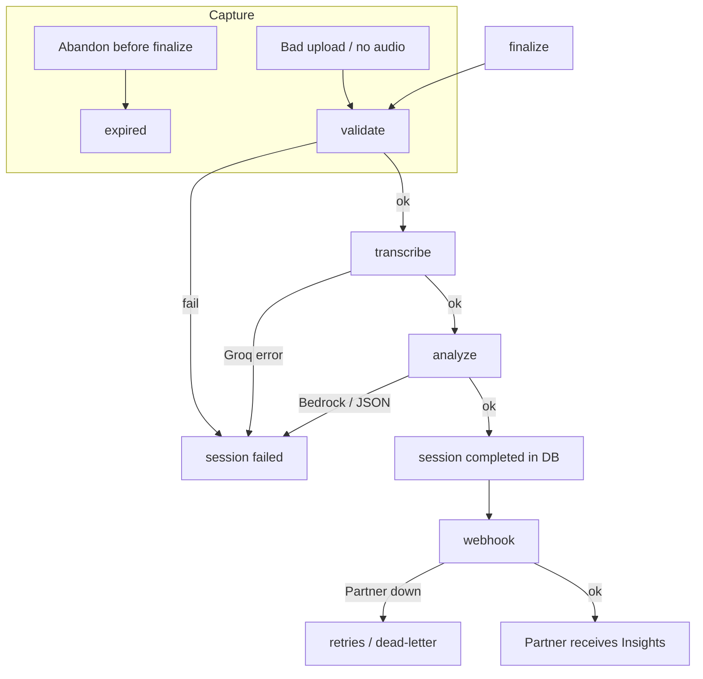

# Hearloop — E2E failure paths

```mermaid
flowchart TD
  subgraph capture["Capture"]
    C1[Abandon before finalize] --> E1[expired]
    C2[Bad upload / no audio] --> V
  end
  F[finalize] --> V[validate]
  V -->|fail| F1[session failed]
  V -->|ok| T[transcribe]
  T -->|Groq error| F1
  T -->|ok| A[analyze]
  A -->|Bedrock / JSON| F1
  A -->|ok| COMP[session completed in DB]
  COMP --> W[webhook]
  W -->|Partner down| R[retries / dead-letter]
  W -->|ok| OK[Partner receives Insights]
```
