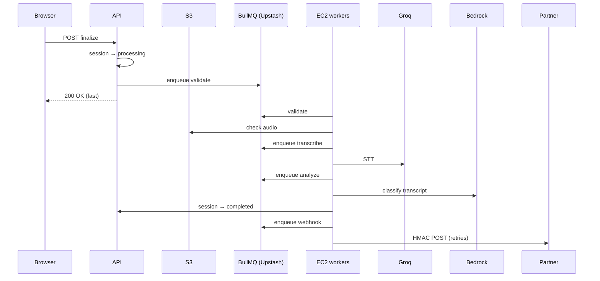

# Hearloop — Async pipeline (interview diagram)

## Sequence (after finalize)

## Session states (capture → done)

`created → opened → recording → uploaded → submitted → processing → completed | failed | expired`
