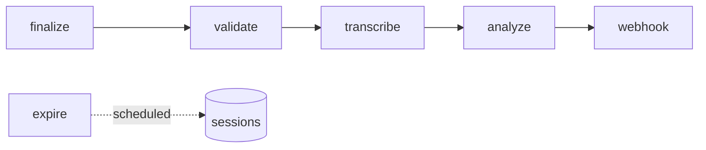

# Hearloop — Five pipeline stages

```mermaid
flowchart LR
  F[finalize] --> V[validate]
  V --> T[transcribe]
  T --> A[analyze]
  A --> W[webhook]
  X[expire] -.->|scheduled| S[(sessions)]
```

Hot path: validate → transcribe → analyze → webhook. Expire is scheduled cleanup, not chained after webhook.
