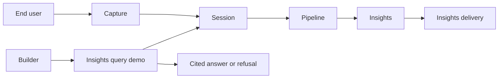

# BRD-01: Insights query

## Document Control

| Field | Value |
| --- | --- |
| Project Name | Hearloop |
| Document Version | 1.3 |
| Date | 2026-08-17 |
| Document Owner | Shubh Kapadia |
| Prepared By | Agent (`/brd` skill) |
| Status | **Draft v1.3 — pending owner approval for portfolio scope** |
| BRD Type | Feature — **portfolio learning** (not a customer investment case) |
| Documentation order | **Retroactive** — product spec v4 and ODs were signed first. Independent sealed-packet review (Aug 17) scored the v1.2 business case **2/10**. Owner chose **Path A**: keep the engineering contract; stop claiming customer demand. |

### Document Revision History

| Version | Date | Author | Changes |
| --- | --- | --- | --- |
| 1.0 | 2026-08-17 | Agent | Initial BRD — retroactive to approved spec v4 |
| 1.1 | 2026-08-17 | Agent | Locked BRD.01.32.05 Observability |
| 1.2 | 2026-08-17 | Agent | Review patches: status, objectives, GA metrics, Security/Infra fixes, corpus rule, Appendix C/D |
| 1.3 | 2026-08-17 | Agent | Path A — portfolio honesty: relabel scope, rename objective, empty-corpus = demo not pilot, eval+demo not market GA |

### Owner sign-off

| Role | Name | Date | Approval |
| --- | --- | --- | --- |
| Document owner | Shubh Kapadia | | **Pending — portfolio scope only** |

**This BRD is not binding for tickets until the owner row is approved.**

Approval, if given, funds **eval-gated builder demo** of Insights query. It does **not** fund a Partner product launch, paid pilot, or market GA. Spec v4 “pilot / GA” language remains a **product-readiness bar** for a later customer BRD — it is not in scope here.

---

## 1. Executive Summary

Hearloop already captures voice feedback and returns structured **Insights**. **Insights query** (bounded count / list / quote with **Cited answers** or **refusal**) is a plausible next capability on that spine.

This BRD does **not** claim a validated Partner need, named buyer, or willingness-to-pay. Independent review of v1.2 found no customer evidence in the packet. The owner accepts that finding.

**What this BRD funds:** a **portfolio demonstration** — eval-gated accuracy, cited retrieval on Postgres, tenant isolation, and measurable latency/cost — on the existing stack (~$10–15/mo). Reject lakehouse, open chatbot, and prescribing Partner operations.

**What it does not fund:** Partner-facing launch, empty-corpus “pilot,” or treating METRICS.md entries as proof of demand.

**Signed product constraints** (spec v4, still binding as engineering rules): OD-7 A, OD-8 waive for internal demo, OD-9, OD-10.

---

## 2. Business Context

### 2.1 Market / problem context

Enterprise VoC already offers “ask your data” (`context/research/feedback-layer-landscape.md`). Hearloop’s wedge is **in-person voice** at **Session** grain.

**Hypothesized** Partner pain: answering “how many negative this week at North Ave?” requires scanning the **By-Target dashboard**. That hypothesis is **unverified**. No named Partner, time-cost, or quote is in this BRD.

The **verified** reason to build v1 is **portfolio learning**: show that citations + eval can be shipped cheaply without a warehouse.

### 2.2 Strategic alignment

| Goal | Status in this BRD |
| --- | --- |
| **Portfolio / learning** | **Primary** — quotable eval bars, cost discipline vs lakehouse |
| **Partner trust** | **Hypothesized** — not a numbered objective; not treated as proven |
| **Product continuity** | Capture → Pipeline → Insights must keep working with query off |
| **North star (parked)** | Multi-modality warehouse — appendix only |

### 2.3 Business objectives

#### BRD.01.23.01: Portfolio demonstrability (primary — locked)

This is the **only** numbered objective. It is about the **builder**, not a paying Partner.

By the **portfolio-complete** decision (BRD.01.06.03), the owner shall have **one interview-ready narrative** backed by **≥3 entries in `context/METRICS.md`**:

1. Eval gate scores (holdout, injection, query citation/refusal/injection)
2. Query p95 on builder-demo traffic (OD-10: 5s target)
3. Infra / token cost for query vs a rejected warehouse path (qualitative table is enough if live query cost is still small-n)

Success = those artifacts exist and can be explained without claiming a customer bought or used Insights query in production.

**Explicitly not an objective:** Partner time-to-answer, retention, revenue, or willingness-to-pay. Those require a **new customer BRD** and evidence this document does not have.

### 2.4 Current state

- **Live product:** Capture → **Pipeline** → **Insights** → dashboard, webhook, urgent-alert email.
- **Data:** ~1,882 `legacy-v0` Sessions; **0** `versioned-v1` (`context/METRICS.md`). Query corpus is empty until **OD-6** plus new captures.
- **Quality:** `GOLDEN_SET` **17/23** diagnostic; launch eval suites not at bar.
- **Product contract:** `docs/superpowers/specs/2026-08-17-insights-query-prd.md` v4 (approved before this BRD). Spec “GA” is **not** funded here.



---

## 3. Stakeholder Analysis

| Stakeholder | Role in this BRD | Success looks like |
| --- | --- | --- |
| **Builder / owner** | **Primary beneficiary** | Defensible demo: gates, METRICS.md, cost cap |
| **Partner** | Hypothesized future user | Not a success criterion here |
| **End user** | Unaffected | Capture unchanged |
| **Optional demo observer** | May sit with builder | Must be told this is a **demo**, not a product trial |

### 3.6 Technology Stack Prerequisites

**N/A — Feature BRD (portfolio learning).** See `context/INFRA.md`, `CONTEXT.md` (Fastify/EC2, Neon, BullMQ, S3, Groq, Bedrock, Vercel).

### 3.7 Mandatory Technology Conditions

**N/A — Feature BRD.** Inherited: tenant isolation, no secret keys in query UI, ~$10–15/mo cost envelope, **OD-6** requires explicit human authorization if production protocol is flipped.

**Primary cost:** builder time, not AWS. Infra increment is $0–3/mo (BRD.01.32.01). This BRD does not estimate person-weeks; tickets should.

---

## 4. Business Requirements

Product behavior detail lives in spec v4. These are **outcomes for the portfolio demo**.

### BRD.01.01.01: Trustworthy label foundation

No **external** query exposure until Partner-action holdout and classifier injection pass published bars. Builder-internal staging with seeded Sessions may proceed.

### BRD.01.01.02: Grounded answers only

Cite inspectable **Sessions** or **refuse** — never uncited strategic advice.

### BRD.01.01.03: Facts, not operations

Hearloop does not prescribe Partner ops.

### BRD.01.01.04: Tenant-safe retrieval

Cross-Partner leakage is unacceptable even in a demo.

### BRD.01.01.05: Evidence integrity for query corpus

Exclude legacy unpinned Sessions from query corpus (**OD-7 A**). Empty corpus is expected until OD-6 + new captures.

### BRD.01.01.06: Continuity of today’s product

Capture, Pipeline, and Insights delivery keep working when query is off.

### BRD.01.01.07: Cost-disciplined accuracy

Accuracy via **eval + citations**, not lakehouse fine-tuning.

### BRD.01.01.08: Eval-gated demo with kill switch

Builder eval → **builder demo** (flag off by default). Per-Partner and global kill switches. **No Partner pilot and no market GA in this BRD.**

---

## 5. Success Criteria

### BRD.01.06.01: Pre-demo eval gates (must pass before any non-builder sees query)

| Gate | Bar |
| --- | --- |
| Partner-action holdout | 15/15 |
| Classifier injection | 5/5 |
| Query citation suite | 100% |
| Query refusal suite | 100% |
| Query injection suite | 100% |
| Cross-Partner isolation | 0 leaks |

`GOLDEN_SET` = diagnostic only (17/23 baseline). These bars are **engineering quality targets**, not evidence of Partner value.

### BRD.01.06.02: Builder-demo metrics (instrument, do not treat as demand)

Measure on **builder** (and optional observer) traffic: supported-query answer rate (BRD.01.06.03 formula), evidence-results open rate, query p95 (OD-10: 5s).

Do **not** treat repeat use or open rate as market validation. There is no committed Partner.

### BRD.01.06.03: Portfolio-complete (replaces “pilot → GA”)

This BRD is **complete** — and query may stay behind a flag — when **all** of:

- BRD.01.06.01 gates pass on frozen eval sets
- Layer 1 observability live (`Hearloop/InsightsQuery`) — BRD.01.32.05
- **BRD.01.23.01** satisfied (≥3 METRICS.md entries)
- Query p95 ≤ 5s on builder-demo traffic **or** a written METRICS.md note if sample size is too small to claim p95
- Kill switch verified (query off restores dashboard-only product)

**Supported-query answer rate (locked formula — diagnostic for the demo, not a market bar):**

```
numerator   = queries that return a Cited answer (refusal = null)
              for a supported intent (count | list | quote)

denominator = queries classified as supported intent (count | list | quote)
              — excludes unsupported_intent and range_too_wide
              (those are correct refusals, not product failure)

rate        = numerator / denominator
```

Record the rate in METRICS.md. **Do not promote to market GA in this BRD**, regardless of the number. Spec v4’s 70% / 50-query / 14-day rules are **parked** until a customer BRD exists.

### BRD.01.06.04: Portfolio demonstrability

Satisfies **BRD.01.23.01**.

### BRD.01.06.05: Honesty in any showing

If a human other than the builder uses query, they are told: this is a **demo**; legacy Sessions are excluded; corpus may be empty; zeros and refusals are expected.

### BRD.01.06.06: Empty corpus is a demo, not a pilot (locked)

| Activity | Rule |
| --- | --- |
| **Builder demo** | Allowed with **0** `versioned-v1` Sessions. Purpose: eval, UX, refusals, metrics emit. **Not a pilot. Not market evidence.** |
| **Partner-facing exposure** | **Not funded.** Would require a future customer BRD **and** ≥10 completed `versioned-v1` Sessions after **OD-6**. |

Former “Option B empty-corpus pilot” is **retired**. Do not call empty-corpus work a pilot. Do not put it on a Partner-pilot timeline.

---

## 6. Constraints and Assumptions

### Constraints

- Portfolio cost envelope ~$10–15/mo; no standing lakehouse in v1
- Spec v4 ODs remain **engineering** constraints unless reopened
- **OD-6** production flip still needs separate human authorization (not implied by this BRD)
- Deploy, GitHub issues, and BRD approval are separate authorizations
- This BRD cannot be used as evidence that Partners want Insights query

### Assumptions

| Assumption | Class |
| --- | --- |
| In-person service Partner would be the buyer **if** this became a product | **Unverified** — hypothesized; out of scope |
| Postgres = system of record for v1 | Verified |
| 1,882 legacy / 0 versioned-v1 today | Verified |
| Empty-corpus **builder demo** is the intended v1 path | Verified (Path A, Aug 17 2026) |
| `model_used` sufficient for builder demo (OD-8 waive) | Verified for this scope; re-decide before any future customer BRD |

---

## 7. Architecture Decision Requirements

Topics for future ADRs. **No ADR numbers.**

### 7.1 Overview

| Status | Count |
| --- | --- |
| Selected | 5 |
| Pending | 0 |
| N/A | 2 |

### 7.2 Mandatory topics

#### BRD.01.32.01: Infrastructure

**Status:** Selected (minimal — no new compute tier)

**Business Driver:** Demo and observability on the existing stack, not a new hosting tier.

**Business Constraints:**

- Stay on existing EC2 + Vercel + Neon (~$10–15/mo envelope)
- **OD-6** remains a separate authority gate (needed only if production Sessions must enter corpus)
- CloudWatch namespace **`Hearloop/InsightsQuery`** for demo latency evidence
- No second API region or container service for v1

**Alternatives Overview:**

| Option | Est. monthly | Rationale |
| --- | --- | --- |
| **Extend existing EC2 API + CloudWatch** | **$0–3 incremental** | **Selected** |
| New Lambda/Cloud Run query service | $5–30+ | **Rejected** — split deployment for portfolio scale |
| Larger EC2 instance for query | +$8–15 | **Rejected** until demo p95 proves need |

**Recommended Selection:** Minimal mutations on current platform (metrics namespace, dashboard hook, optional OD-6) — not a new infra tier.

**PRD Requirements:** OD-6 remains an authority workflow, not a BRD-01 deliverable. Verify Pipeline CloudWatch emit before relying on the query metrics pattern (Appendix D).

---

#### BRD.01.32.02: Data Architecture

**Status:** Selected

**Business Driver:** Query Sessions with inspectable evidence without a warehouse — so the portfolio story is “citations on Postgres,” not “we would have used Databricks if we had budget.”

**Business Constraints:** Postgres SoR; no Snowflake/Databricks v1; OD-7 A; OD-9 count evidence shape.

**Alternatives Overview:**

| Option | Est. monthly | Rationale |
| --- | --- | --- |
| **Postgres query layer** | $0 incremental | **Selected** |
| Warehouse ELT | $50–500+ | **Rejected** |
| Knowledge graph | $25–200+ | **Rejected** |

**Recommended Selection:** Postgres on Neon.

**PRD Requirements:** Filter schema (OD-1), pagination, `versioned-v1` corpus eligibility.

---

#### BRD.01.32.03: Integration

**Status:** N/A — dashboard-only v1; no Slack/email/public query API.

**Note:** Evidence-open logging for demo metrics is **in-scope** via Observability + Appendix D.

**PRD Requirements:** Phase 2 flag for API/webhook query delivery (not this BRD).

---

#### BRD.01.32.04: Security

**Status:** Selected

**Business Driver:** A demo that leaks another Partner’s Sessions is worse than no demo.

**Business Constraints:** Server-side Partner scope; no probeable tenant errors; query off until BRD.01.06.01 gates pass (except builder staging).

**Alternatives Overview:**

| Option | Est. cost | Rationale |
| --- | --- | --- |
| **App-layer `partner_id` filter + 0-leak tests** | $0 | **Selected for v1** |
| **Postgres row-level security** | $0 + migration | **N/A for v1** |
| Separate DB per Partner | $N × Neon | **Rejected** |

**Recommended Selection:** App-layer isolation with **0-leak integration tests** as a demo gate. RLS is out of v1 scope.

**PRD Requirements:** Isolation suite; security review before any non-builder exposure.

---

#### BRD.01.32.05: Observability

**Status:** Selected

**Business Driver:** Portfolio completeness requires latency and eval evidence, not vibes.

**Business Constraints:**

- Log intent, refusal code, latency, totalCount — **not raw question text**
- Log `partnerIdHash` only — **never** raw Partner id in CloudWatch dimensions
- p95 ≤ 5s is a **demo quality** target (OD-10), not a market-GA blocker in this BRD
- $0 incremental vendor spend — extend existing Pino + CloudWatch pattern
- Verify Pipeline CloudWatch emit before treating query metrics as proven (Appendix D)

**Alternatives Overview:**

| Option | Est. monthly | Rationale |
| --- | --- | --- |
| **Pino + CloudWatch `Hearloop/InsightsQuery`** | $0–3 | **Selected** |
| Datadog / New Relic | $15–100+ | **Rejected** |
| METRICS.md manual only | $0 | **Rejected alone** |

**Recommended Selection — two layers:**

**Layer 1 — Operational:** Every query request produces structured logs and CloudWatch metrics (latency, request count by intent, refusal count by code).

**Layer 2 — Portfolio rollup:** Periodic write into `context/METRICS.md`; evidence-open events in the demo UI.

Implementation detail: **Appendix D**.

**PRD Requirements:** Layer 1 before calling the demo “instrumented”; Layer 2 before BRD.01.06.03 complete.

---

#### BRD.01.32.06: AI/ML Architecture

**Status:** Selected

**Business Driver:** Demonstrable accuracy — the portfolio claim is “eval + citations,” not “trained on lots of data.”

**Business Constraints:** Eval gates; no bulk fine-tuning; query injection suite; Bedrock spend stays within the existing analyze envelope unless OD-4 quote path adds bounded compose. Token ceiling belongs in tickets, not this BRD.

**Recommended Selection:** Dual-track eval (labels + query citations/refusals/injection).

**PRD Requirements:** Frozen corpora; OD-4 for quote retrieval.

---

#### BRD.01.32.07: Technology Selection

**Status:** N/A — locked Hearloop stack.

---

## 8. Risk Assessment

| Risk | Likelihood | Impact | Mitigation |
| --- | --- | --- | --- |
| Launch gates never reached | Medium | High | No query UI; keep core product |
| Empty corpus mistaken for a pilot | High | High | BRD.01.06.06 — demo language only |
| Fluent wrong citation in a demo | Medium | High | 100% citation eval before any showing |
| Portfolio narrative overclaims demand | Medium | High | BRD.01.23.01 forbids WTP/retention claims |
| Pipeline CloudWatch not live | Medium | Medium | Verify before demo completeness (Appendix D) |
| Scope creep (lakehouse/chat/GA) | Medium | High | Non-goals §10 |
| Privacy in query logs | Low | Medium | No raw questions; partnerIdHash only |
| Neon slow queries at scale | Low | Low | Irrelevant until a customer BRD |

---

## 9. Traceability

### Upstream

| Source | Reference |
| --- | --- |
| Domain glossary | `CONTEXT.md` |
| Design spec | `docs/superpowers/specs/2026-08-17-insights-query-design.md` |
| Research | `context/research/feedback-layer-landscape.md` |
| Infra | `context/INFRA.md` |
| Metrics | `context/METRICS.md` |
| Scope decision | Path A (owner, 2026-08-17) after sealed-packet independent reviews |

### Downstream

| Artifact | Reference | Status |
| --- | --- | --- |
| Product spec | `docs/superpowers/specs/2026-08-17-insights-query-prd.md` v4 | Approved engineering contract; **GA/pilot stages not funded by this BRD** |
| Eval design | `docs/superpowers/specs/2026-08-16-insights-partner-action-eval-design.md` | Exists |
| Tickets | `to-tickets` after **owner approves this BRD** (portfolio-scope tickets only) | Pending |
| ADRs | §7.2 topics when implementation starts | Not written |
| Customer BRD | None | Required before Partner-facing launch |

### Element tags (downstream)

- `@brd: BRD.01.23.01` — portfolio demonstrability (sole numbered objective)
- `@brd: BRD.01.06.03` — portfolio-complete (not market GA)
- `@brd: BRD.01.06.06` — empty corpus = demo, not pilot
- `@brd: BRD.01.32.05` — observability two-layer model

### Related BRDs

| Relationship | BRD |
| --- | --- |
| @depends-brd | null (no platform BRD; stack via INFRA.md) |

---

## 10. Out of Scope (Business)

- Treating this BRD as a **customer investment case**
- Named-buyer discovery, paid pilot, LOI, pricing, WTP
- Partner-facing **pilot** or **market GA**
- Calling empty-corpus work a pilot
- Enterprise VoC replacement
- Every feedback modality in this initiative
- Lakehouse / knowledge graph v1 investment
- Bulk fine-tuning
- Prescribing Partner ops
- Live shop as a business gate
- Legacy Sessions in query corpus (OD-7 A)
- Postgres RLS in v1

---

## 11. Glossary

Uses `CONTEXT.md`. Key terms: **Insights query**, **Cited answer**, **Session**, **Insights**, **Target**, **Pipeline**.

**Builder demo** (this BRD): internal or observer showing of Insights query, including empty corpus. Not a Partner pilot.

**Portfolio-complete:** BRD.01.06.03 — eval + observability + METRICS.md artifacts. Not market GA.

---

## 12. Appendices

### Appendix A — Rejected north star

Warehouse + fine-tune + knowledge graph — parked, not funded.

### Appendix B — Signed product decisions (spec v4)

Engineering constraints. “Pilot / GA” in the spec is **not** funded by BRD-01 v1.3.

| ID | Decision |
| --- | --- |
| OD-7 | A — exclude legacy from query corpus |
| OD-8 | Waive lineage for **builder demo**; re-sign before any future customer BRD |
| OD-9 | totalCount + evidenceResultsUrl |
| OD-10 | 90d / 50 / 10 / 5s p95 as **demo quality** targets |

### Appendix C — Review record

| Review | Score | Use |
| --- | --- | --- |
| Same-session Sol/Sonnet on v1.1 craft | 7.0 / 7.5 | Improved structure; **biased** (author loop) |
| Sealed-packet independent (two reviewers, Aug 17) | Craft ~6.5–7; **business case 2/10**; **Do not fund** as a customer case | **Accepted.** Path A: fund as portfolio learning only |

**v1.3 response:** relabel type; BRD.01.23.01 sole objective and explicit; Option B retired; portfolio-complete replaces GA; Partner buyer assumption unmarked Verified.

### Appendix D — Ticket implementation checklist (not business requirements)

1. Extend CloudWatch helper for **`Hearloop/InsightsQuery`** (`QueryLatencyMs`, `QueryRequestCount`, `QueryRefusalCount`)
2. Insights query HTTP route: Pino fields + metric emit; warn-and-continue on emit failure
3. Define `partnerIdHash` in implementation spec
4. Verify **`Hearloop/Pipeline`** CloudWatch emit (fill METRICS.md “After” or document gap)
5. Extend `scripts/capture-metrics.sh` (or sibling) for query p50/p95 and answer-rate **diagnostic** rollup
6. Dashboard: evidence-open event in demo UI
7. Do not log raw questions in production
8. Default query **off**; kill switch tested
9. Ticket titles and descriptions must say **builder demo / portfolio**, not **Partner pilot / GA**

---

**Next step:** Owner approves **portfolio scope** → `to-tickets` for eval + demo only. Do not schedule a Partner pilot from this BRD.
