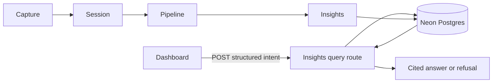

# Insights query — system architecture (builder demo)

**Gate:** 2 of 4 (product → **architecture** → program design → slices)  
**Status:** Draft — load-bearing walls only  
**Scope:** BRD-01 Path A (portfolio demo). Not a Partner launch. Not a new platform.

This page settles **where query lives** so an agent cannot invent a second backend during review.

---

## What we are adding

One **read path** on the existing Hearloop stack.

A signed-in Partner (builder, for now) submits a **structured** question. The API looks at **that Partner’s** completed Sessions in Neon Postgres and returns a **Cited answer** or a **refusal**. Capture, Pipeline, and Insights delivery do not change.

## What we are not adding

- No new host, queue, database, warehouse, or vector store
- No write into `analyses` / Insights
- No Slack, email, or public query API
- No production `versioned-v1` flip (OD-6) for this demo
- No free-text chatbot. The dashboard sends **intent + filters**, not a chat transcript

---

## Where it lives

| Piece | Today | Demo |
| --- | --- | --- |
| API | Fastify on EC2 (`apps/api`) | Same process. New route next to `/v1/partners/me/dashboard` |
| Web | Next.js on Vercel, dashboard at `/dashboard` | Same app. Query panel on the dashboard, hidden unless flag on |
| Auth | `authenticatePartner` (`hlps.*` session) | Same preHandler. Partner id comes from the session, never from the body |
| Data | Neon: `sessions` + `analyses` (+ Target in session metadata) | **SELECT only**, always `WHERE partner_id = <session partner>` |
| Flag | none | Env `INSIGHTS_QUERY_ENABLED` default **off**. Off → 404, dashboard hides the panel |

Pipeline stays a **write** path. Query is a **read** path. They share Postgres. They do not share jobs.

---

## Hard rules (reviewers: argue these here, not in the PR)

1. **Tenant wall.** Every SQL query includes `sessions.partner_id = req.partner.id`. A missing filter is a bug, not a product choice. Cross-Partner rows in a response = fail the demo.
2. **Corpus.** Citable rows: `status = completed` AND `upload_protocol = versioned-v1`. Production has **0** of these. The demo uses **seeded** rows in local/staging, not the 1,882 `legacy-v0` Sessions.
3. **Intents.** `count` | `list` | `quote` only. Anything else → refusal `unsupported_intent`.
4. **Zero count** is a valid answer. **Quote with no matches** is a refusal.
5. **Retrieval is SQL** (filters on sentiment, urgency, topic, Target, time range). No embeddings in this demo. Quote text is a transcript snippet from the matched row.
6. **Limits.** Date range > 90 days → `range_too_wide`. List page 50. At most 10 quote citations.
7. **No raw question logging.** Log intent, refusal code, latency, `totalCount`.

---

## Request / response (contract the route must keep)

**In:** `POST /v1/partners/me/insights-query`  
Body: `{ intent, filters }` — filters are allowlisted fields only (no free SQL).

**Out:** the PRD `CitedAnswer` shape (`summary`, `totalCount` / `evidenceResultsUrl` for count, `citations` for list/quote, or `refusal`).

Count does **not** attach one citation per Session (OD-9). List/quote citations must be real `sessionId`s that passed the tenant + corpus filters.

---

## Demo “done”

A builder can, against **seeded** `versioned-v1` Sessions:

1. Ask a **count** and see a number plus a way to inspect matching Sessions  
2. Ask a **list** or **quote** and click through to those Sessions  
3. Get a **refusal** for “what should I do?” or a range over 90 days  
4. Prove Partner B’s Sessions never appear for Partner A  

Kill switch: set `INSIGHTS_QUERY_ENABLED` off. Core product unchanged.

---

## Next gate

Program design (written): `docs/superpowers/specs/2026-08-18-insights-query-program-design.md`.

Do not start CloudWatch namespaces, OD-6, or Partner-facing rollout from this architecture.
